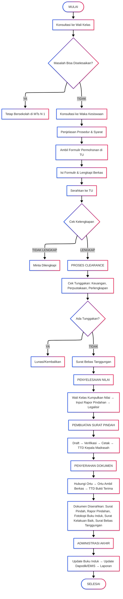

# MUTASI SISWA KELUAR

<!-- FIXME: Pemadanan data -->

|                       |                                                                                                |
| --------------------- | ---------------------------------------------------------------------------------------------- |
| **Kode SOP**          | SOP/AKD/004                                                                                    |
| **Tanggal Pembuatan** | 2 Januari 2025                                                                                 |
| **Tanggal Revisi**    | -                                                                                              |
| **Tanggal Efektif**   | 2 Januari 2025                                                                                 |
| **Disahkan oleh**     | Kepala MTs Negeri 1 Pandeglang                                                                 |
| **Nama Prosedur**     | Mutasi Siswa Keluar                                                                            |
| **Dasar Hukum**       | 1. UU No. 20 Tahun 2003 2. Permendikbud No. 18 Tahun 2016 3. Juknis Mutasi Siswa Kemenag |

---

## 1. TUJUAN

- Memberikan pelayanan mutasi keluar yang cepat dan tertib
- Memastikan penyelesaian administrasi siswa yang pindah
- Menjaga hubungan baik dengan siswa dan orang tua
- Memudahkan siswa melanjutkan pendidikan di sekolah tujuan

## 2. RUANG LINGKUP

SOP ini mengatur:

- Prosedur pengajuan mutasi keluar
- Penyelesaian administrasi dan keuangan
- Penerbitan surat pindah dan dokumen pendukung
- Pencatatan dan pelaporan mutasi keluar

## 3. DEFINISI

- **Mutasi Keluar**: Perpindahan siswa dari MTs Negeri 1 Pandeglang ke sekolah/madrasah lain
- **Surat Pindah**: Surat resmi dari madrasah yang menyatakan siswa pindah
- **Rapor Pindahan**: Rapor lengkap yang diserahkan ke sekolah tujuan
- **Clearance**: Penyelesaian administrasi dan keuangan sebelum pindah

## 4. PENANGGUNG JAWAB

- **Kepala Madrasah**: Pengesahan surat pindah
- **Wakil Kepala Kesiswaan**: Koordinator mutasi keluar
- **Wakil Kepala Kurikulum**: Penyelesaian nilai dan rapor
- **Kepala TU**: Administrasi mutasi
- **Wali Kelas**: Rekomendasi dan dokumentasi

---

## 5. ALASAN MUTASI KELUAR

### A. Alasan yang Dapat Diterima:

1. **Ikut orang tua pindah tugas/domisili**
2. **Jarak rumah terlalu jauh** (dengan bukti)
3. **Alasan kesehatan** (dengan surat dokter)
4. **Masalah keluarga** (perceraian, ekonomi, dll)
5. **Masalah adaptasi** (dengan rekomendasi guru BK)
6. **Pindah ke sekolah yang lebih sesuai minat** (pesantren, sekolah kejuruan, dll)

### B. Alasan yang Memerlukan Pertimbangan Khusus:

1. **Masalah pelanggaran disiplin berat** (tetap diberikan surat pindah)
2. **Prestasi akademik rendah** (dengan catatan)
3. **Konflik dengan teman/guru** (diselesaikan dulu, jika tidak bisa baru pindah)

---

## 6. PERSYARATAN MUTASI KELUAR

### A. Dokumen yang Harus Disiapkan:

1. **Surat permohonan pindah** dari orang tua/wali bermaterai
2. **Fotokopi Kartu Keluarga (KK)**
3. **Fotokopi KTP orang tua**
4. **Surat pernyataan tidak ada tunggakan** (dari bendahara)
5. **Surat keterangan kelakuan baik** (dari wali kelas)
6. **Bukti pengembalian buku perpustakaan & perlengkapan** (dari petugas perpus)

### B. Dokumen Pendukung (sesuai alasan):

- **Surat pindah tugas orang tua** (jika ikut ortu pindah)
- **Surat keterangan domisili baru** (jika pindah domisili)
- **Surat keterangan dokter** (jika alasan kesehatan)
- **Surat pernyataan orang tua** (untuk alasan lainnya)

---

## 7. PROSEDUR MUTASI KELUAR

### TAHAP 1: KONSULTASI AWAL

| No  | Kegiatan                                             | Pelaksana      | Waktu    | Keterangan          |
| --- | ---------------------------------------------------- | -------------- | -------- | ------------------- |
| 1   | Orang tua/siswa konsultasi ke wali kelas             | Ortu/Siswa     | 30 menit | Sampaikan alasan    |
| 2   | Wali kelas mendengar dan memberi masukan             | Wali Kelas     | 30 menit | Cari solusi terbaik |
| 3   | Jika tetap ingin pindah, diarahkan ke Waka Kesiswaan | Wali Kelas     | 10 menit | Surat pengantar     |
| 4   | Konsultasi dengan Waka Kesiswaan                     | Ortu/Siswa     | 30 menit | Konfirmasi alasan   |
| 5   | Waka Kesiswaan memberikan penjelasan prosedur        | Waka Kesiswaan | 15 menit | Syarat & tahapan    |
| 6   | Jika masih bisa diselesaikan, diberi waktu berpikir  | Waka Kesiswaan | 3-7 hari | Pertimbangan ulang  |
| 7   | Jika tetap pindah, diarahkan ke TU                   | Waka Kesiswaan | 5 menit  | Ambil formulir      |

**Catatan:** Madrasah akan berusaha mencari solusi agar siswa tidak pindah, kecuali alasan mendesak

---

### TAHAP 2: PENGAJUAN PERMOHONAN

| No  | Kegiatan                                      | Pelaksana | Waktu    | Keterangan         |
| --- | --------------------------------------------- | --------- | -------- | ------------------ |
| 1   | Mengambil formulir permohonan mutasi keluar   | Ortu      | 5 menit  | Di loket TU        |
| 2   | Mengisi formulir dengan lengkap               | Ortu      | 20 menit | Di rumah/di tempat |
| 3   | Melengkapi dokumen persyaratan                | Ortu      | 1-3 hari | Sesuai daftar      |
| 4   | Menyerahkan formulir & berkas ke TU           | Ortu      | 10 menit | Loket TU           |
| 5   | Petugas TU mengecek kelengkapan               | Staf TU   | 15 menit | Checklist          |
| 6   | Memberikan tanda terima berkas                | Staf TU   | 5 menit  | Nomor registrasi   |
| 7   | Pencatatan dalam buku ekspedisi mutasi keluar | Staf TU   | 10 menit | Nomor urut         |

---

### TAHAP 3: PROSES CLEARANCE (BEBAS TANGGUNGAN)

| No  | Kegiatan                                            | Pelaksana    | Waktu         | Keterangan                     |
| --- | --------------------------------------------------- | ------------ | ------------- | ------------------------------ |
| 1   | **Pengecekan Administrasi Keuangan**                |              |               |                                |
|     | - Cek tunggakan SPP/biaya sekolah                   | Bendahara    | 30 menit      | Harus lunas                    |
|     | - Cek pinjaman buku/alat                            | Perpustakaan | 30 menit      | Harus dikembalikan             |
|     | - Cek seragam/atribut (jika pinjaman)               | Wali Kelas   | 15 menit      | Harus dikembalikan             |
| 2   | **Penyelesaian Tunggakan (jika ada)**               |              |               |                                |
|     | - Pembayaran tunggakan                              | Ortu         | Sesuai jumlah | Ke bendahara                   |
|     | - Pengembalian buku/alat                            | Siswa        | 1 hari        | Ke perpustakaan                |
|     | - Penggantian barang hilang/rusak                   | Ortu         | Sesuai nilai  | Sesuai SK                      |
| 3   | **Pembuatan Surat Keterangan Bebas Tanggungan**     |              |               |                                |
|     | - Bendahara membuat surat bebas tanggungan keuangan | Bendahara    | 15 menit      | Stempel & TTD                  |
|     | - Perpustakaan membuat surat bebas pinjaman         | Pustakawan   | 15 menit      | Stempel & TTD                  |
|     | - Wali kelas membuat surat kelakuan baik            | Wali Kelas   | 30 menit      | Catatan prestasi & pelanggaran |

**Waktu Clearance:** 1-3 hari (tergantung ada tunggakan atau tidak)

---

### TAHAP 4: PENYELESAIAN NILAI DAN RAPOR

| No  | Kegiatan                                 | Pelaksana       | Waktu  | Keterangan                  |
| --- | ---------------------------------------- | --------------- | ------ | --------------------------- |
| 1   | Wali kelas meminta nilai dari guru mapel | Wali Kelas      | 1 hari | Nilai sampai terakhir masuk |
| 2   | Guru mapel memberikan nilai siswa        | Guru Mapel      | 2 hari | Nilai tugas, UH, UTS/UAS    |
| 3   | Wali kelas merekap nilai                 | Wali Kelas      | 1 hari | Format rapor                |
| 4   | Input nilai ke rapor pindahan            | Wali Kelas      | 2 jam  | Manual & digital            |
| 5   | Verifikasi nilai oleh Waka Kurikulum     | Waka Kurikulum  | 1 hari | Cek keakuratan              |
| 6   | Cetak rapor pindahan                     | Staf TU         | 1 jam  | Format resmi                |
| 7   | Legalisir rapor                          | Kepala Madrasah | 1 hari | TTD & cap                   |

**Format Rapor Pindahan:**

- Nilai dari awal semester sampai siswa pindah
- Catatan: "Pindah ke [nama sekolah] tanggal [tanggal]"
- Tanda tangan Wali Kelas, Waka Kurikulum, Kepala Madrasah

---

### TAHAP 5: PEMBUATAN SURAT PINDAH

| No  | Kegiatan                                  | Pelaksana       | Waktu    | Keterangan         |
| --- | ----------------------------------------- | --------------- | -------- | ------------------ |
| 1   | Staf TU menyiapkan draft surat pindah     | Staf TU         | 30 menit | Format baku        |
| 2   | Melengkapi data siswa dari buku induk     | Staf TU         | 20 menit | Data lengkap       |
| 3   | Verifikasi draft oleh Kepala TU           | Kepala TU       | 30 menit | Cek keakuratan     |
| 4   | Cetak surat pindah di kertas berkop       | Staf TU         | 15 menit | -                  |
| 5   | Penomoran surat                           | Staf TU         | 10 menit | Sesuai buku agenda |
| 6   | Disposisi ke Kepala Madrasah              | Kepala TU       | 1 hari   | Untuk TTD          |
| 7   | Penandatanganan oleh Kepala Madrasah      | Kepala Madrasah | 1 hari   | TTD & cap basah    |
| 8   | Pencatatan di buku ekspedisi surat keluar | Staf TU         | 10 menit | Arsip              |

**Isi Surat Pindah:**

- Kop surat Kemenag & MTs Negeri 1 Pandeglang
- Nomor surat, tanggal
- Perihal: Surat Keterangan Pindah Sekolah
- Data siswa lengkap (nama, NIS, NISN, TTL, kelas terakhir)
- Alasan pindah
- Sekolah tujuan (jika sudah tahu)
- Catatan prestasi & pelanggaran (jika ada)
- TTD Kepala Madrasah & cap

---

### TAHAP 6: PENYERAHAN DOKUMEN

| No  | Kegiatan                                        | Pelaksana | Waktu    | Keterangan        |
| --- | ----------------------------------------------- | --------- | -------- | ----------------- |
| 1   | Staf TU menghubungi orang tua untuk pengambilan | Staf TU   | 1 hari   | Via telepon/WA    |
| 2   | Orang tua datang dengan identitas               | Ortu      | -        | KTP/KK            |
| 3   | Petugas TU menyiapkan berkas lengkap:           |           |          |                   |
|     | - Surat pindah (asli)                           | Staf TU   | 5 menit  | 1 lembar          |
|     | - Rapor pindahan (asli, dilegalisir)            | Staf TU   | 5 menit  | Lengkap           |
|     | - Fotokopi buku induk siswa (dilegalisir)       | Staf TU   | 5 menit  | 1 lembar          |
|     | - Surat kelakuan baik                           | Staf TU   | 5 menit  | Dari wali kelas   |
|     | - Surat keterangan prestasi (jika ada)          | Staf TU   | 5 menit  | Piagam/sertifikat |
|     | - Surat bebas tanggungan                        | Staf TU   | 5 menit  | Keuangan & perpus |
| 4   | Penjelasan dokumen kepada orang tua             | Staf TU   | 10 menit | Pastikan paham    |
| 5   | Orang tua menandatangani bukti penerimaan       | Ortu      | 5 menit  | Buku ekspedisi    |
| 6   | Penyerahan dokumen                              | Staf TU   | 5 menit  | Map berkas        |
| 7   | Ucapan terima kasih dan doa                     | Staf TU   | 5 menit  | Perpisahan baik   |

---

### TAHAP 7: ADMINISTRASI AKHIR

| No  | Kegiatan                               | Pelaksana  | Waktu    | Keterangan            |
| --- | -------------------------------------- | ---------- | -------- | --------------------- |
| 1   | Update status siswa di buku induk      | Staf TU    | 15 menit | Status: Pindah        |
| 2   | Update data di sistem Dapodik/EMIS     | Operator   | 30 menit | Status: Keluar/Pindah |
| 3   | Arsip fotokopi surat pindah            | Staf TU    | 10 menit | File pribadi siswa    |
| 4   | Pengurangan jumlah siswa di data kelas | Wali Kelas | 10 menit | Absensi & daftar      |
| 5   | Laporan ke Kepala Madrasah             | Kepala TU  | 1 hari   | Data mutasi keluar    |
| 6   | Laporan ke Kemenag Kabupaten           | Operator   | 3 hari   | Via sistem online     |
| 7   | Penyimpanan berkas dalam arsip         | Staf TU    | 15 menit | Ruang arsip           |

---

## 8. WAKTU PENYELESAIAN

| Kondisi                            | Waktu Total                                        |
| ---------------------------------- | -------------------------------------------------- |
| **Tanpa Tunggakan**                | 5-7 hari kerja                                     |
| **Ada Tunggakan (perlu dilunasi)** | 7-14 hari kerja                                    |
| **Kasus Mendesak/Darurat**         | 3 hari kerja (dengan pertimbangan Kepala Madrasah) |

**Catatan:** Waktu dihitung sejak berkas lengkap diterima TU

---

## 9. DIAGRAM ALUR MUTASI KELUAR

---

## 10. BIAYA

**Prinsip: Mutasi Keluar GRATIS**

Tidak ada pungutan untuk:

- Formulir permohonan
- Surat pindah
- Rapor pindahan
- Legalisir dokumen
- Proses administrasi

**Kewajiban Finansial:**

- Melunasi tunggakan SPP/biaya sekolah (jika ada)
- Mengganti buku/alat yang hilang/rusak (sesuai harga)

---

## 11. JAM PELAYANAN

**Konsultasi:**

- Senin - Kamis: 08.00 - 14.30 WIB
- Jumat: 08.00 - 10.30 WIB
- Sabtu: 08.00 - 12.00 WIB

**Pengambilan Dokumen:**

- Senin - Kamis: 08.00 - 14.00 WIB
- Jumat: 08.00 - 10.00 WIB

---

## 12. PENCATATAN DAN PELAPORAN

### A. Buku Register Mutasi Keluar:

| No  | Tgl Permohonan | Nama Siswa   | Kelas  | Alasan Pindah    | Sekolah Tujuan | Tgl Surat Pindah | Ket     |
| --- | -------------- | ------------ | ------ | ---------------- | -------------- | ---------------- | ------- |
| 1   | 10/01/2025     | Budi Santoso | VIII-B | Ikut ortu pindah | SMP N 1 Serang | 15/01/2025       | Selesai |

### B. Laporan Bulanan ke Kepala Madrasah:

- Jumlah siswa yang pindah
- Distribusi per kelas
- Alasan pindah (statistik)
- Analisis dan rekomendasi

### C. Laporan Semester ke Kemenag:

- Rekapitulasi mutasi keluar
- Data lengkap siswa yang pindah
- Sekolah tujuan
- Evaluasi proses

---

## 13. HAL PENTING YANG PERLU DIPERHATIKAN

### A. Bagi Madrasah:

✅ **WAJIB:**

- Melayani dengan ramah meskipun siswa pindah
- Mempercepat proses jika mendesak
- Memberikan dokumen lengkap dan sah
- Menjaga hubungan baik dengan siswa & ortu
- Tidak menahan dokumen dengan alasan apapun

❌ **DILARANG:**

- Mempersulit proses mutasi keluar
- Menunda-nunda penerbitan surat pindah
- Menahan ijazah/dokumen penting
- Meminta biaya di luar ketentuan

### B. Bagi Siswa/Orang Tua:

✅ **WAJIB:**

- Mengurus mutasi sesuai prosedur
- Menyelesaikan semua tanggungan
- Mengambil dokumen tepat waktu
- Menjaga hubungan baik

❌ **DILARANG:**

- Kabur tanpa surat pindah
- Meninggalkan tunggakan
- Memalsukan dokumen

---

## 14. PENANGANAN KASUS KHUSUS

### A. Siswa Pindah Tanpa Pamit (Kabur):

1. Wali kelas melaporkan ke Waka Kesiswaan
2. Menghubungi orang tua (maksimal 3x)
3. Jika tidak ada respon selama 1 bulan:
   - Status: "Tidak diketahui keberadaannya"
   - Tetap tercatat di buku induk
   - Jika nanti minta surat pindah, harus selesaikan administrasi dulu

### B. Siswa Pindah karena Dikeluarkan:

1. Sesuai SK Kepala Madrasah tentang sanksi
2. Tetap diberikan surat pindah (hak siswa)
3. Dalam surat kelakuan baik dicantumkan catatan pelanggaran
4. Proses sama dengan mutasi keluar biasa

### C. Siswa Pindah saat Tengah Semester:

1. Nilai yang sudah ada dimasukkan ke rapor pindahan
2. Nilai yang belum ada dikosongkan atau diberi keterangan
3. Sekolah tujuan yang akan melanjutkan penilaian

---

## 15. PENGADUAN

**Jika ada masalah dalam proses mutasi keluar:**

Hubungi:

- Kepala TU: [Nomor HP]
- Waka Kesiswaan: [Nomor HP]
- Email: pengaduan@mtsn1pandeglang.sch.id
- Datang langsung ke ruang TU

**Tindak Lanjut:** Maksimal 1x24 jam

---

## 16. PENUTUP

SOP ini dibuat untuk memberikan pelayanan terbaik kepada siswa yang akan pindah, dengan tetap menjaga nama baik madrasah dan hubungan baik dengan semua pihak.

---

Ditetapkan di: Pandeglang  
Pada Tanggal: 2 Januari 2025

**Kepala MTs Negeri 1 Pandeglang**

**H. EMAN SULAIMAN, S.Ag., M.Pd.**  
NIP. 197006032000031002
