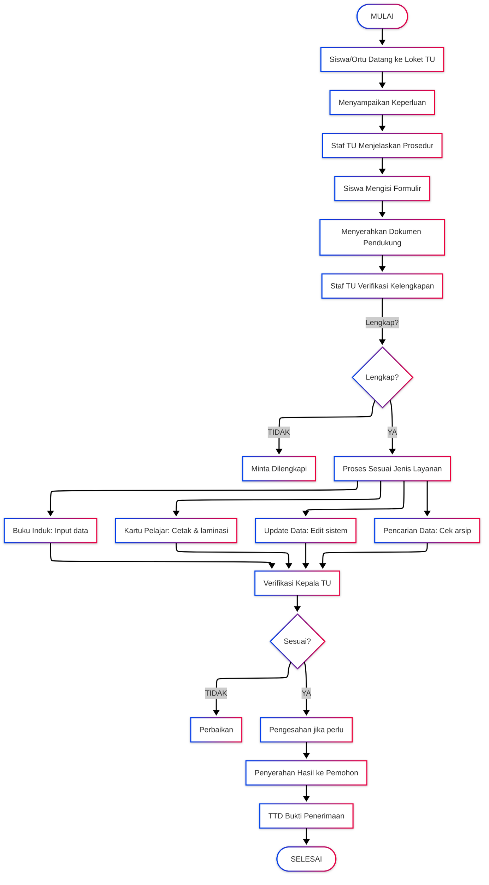

# PELAYANAN ADMINISTRASI SISWA

<!-- FIXME: Pemadanan data -->

|                       |                                                                                             |
| --------------------- | ------------------------------------------------------------------------------------------- |
| **Kode SOP**          | SOP/AKD/002                                                                                 |
| **Tanggal Pembuatan** | 2 Januari 2025                                                                              |
| **Tanggal Revisi**    | -                                                                                           |
| **Tanggal Efektif**   | 2 Januari 2025                                                                              |
| **Disahkan oleh**     | Kepala MTs Negeri 1 Pandeglang                                                              |
| **Nama Prosedur**     | Pelayanan Administrasi Siswa                                                                |
| **Dasar Hukum**       | 1. UU No. 20 Tahun 2003 2. Permendikbud No. 18 Tahun 2016 3. Juknis Kesiswaan Kemenag |

---

## 1. TUJUAN

- Memberikan pelayanan administrasi yang cepat dan akurat kepada siswa
- Mengelola data siswa secara teratur dan sistematis
- Memudahkan siswa dalam mengurus keperluan administratif
- Menjaga keakuratan data dan dokumen siswa

## 2. RUANG LINGKUP

Pelayanan administrasi siswa meliputi:

- Pengelolaan buku induk siswa
- Pembuatan kartu pelajar
- Pengelolaan data siswa di sistem informasi
- Layanan administrasi harian siswa
- Update data siswa
- Arsip dokumen siswa

## 3. DEFINISI

- **Buku Induk**: Buku catatan data pokok siswa
- **Kartu Pelajar**: Identitas resmi siswa
- **NISN**: Nomor Induk Siswa Nasional
- **NIS**: Nomor Induk Siswa (tingkat madrasah)
- **Leger**: Buku daftar kumpulan nilai

## 4. PENANGGUNG JAWAB

- **Kepala Madrasah**: Penanggung jawab keseluruhan
- **Wakil Kepala Kesiswaan**: Koordinator administrasi siswa
- **Kepala TU**: Pengelola data dan arsip
- **Staf TU Bagian Kesiswaan**: Pelaksana teknis

---

## 5. JENIS LAYANAN

### A. PEMBUATAN BUKU INDUK SISWA

**Waktu Pelaksanaan:** Setelah daftar ulang (Minggu ke-1 Tahun Ajaran Baru)

| No  | Kegiatan                                  | Pelaksana       | Waktu  | Keterangan               |
| --- | ----------------------------------------- | --------------- | ------ | ------------------------ |
| 1   | Menerima berkas lengkap dari daftar ulang | Staf TU         | 1 hari | Dari panitia PPDB        |
| 2   | Verifikasi kelengkapan dokumen            | Staf TU         | 2 hari | Cek satu per satu        |
| 3   | Input data siswa ke buku induk            | Staf TU         | 5 hari | Manual & digital         |
| 4   | Pemberian NIS (Nomor Induk Siswa)         | Staf TU         | 1 hari | Format: 2025.XX.XXX      |
| 5   | Pengecekan NISN di sistem Dapodik         | Staf TU         | 2 hari | Verifikasi online        |
| 6   | Pelengkapan data yang kurang              | Staf TU         | 3 hari | Konfirmasi ke siswa/ortu |
| 7   | Verifikasi oleh Kepala TU                 | Kepala TU       | 1 hari | Pengecekan akhir         |
| 8   | Pengesahan oleh Kepala Madrasah           | Kepala Madrasah | 1 hari | Tanda tangan             |

**Data yang Dicatat:**

- Data pribadi siswa (nama, TTL, alamat, agama, dll)
- Data orang tua/wali (nama, pekerjaan, pendidikan, penghasilan)
- Data asal sekolah
- Data kesehatan
- Data prestasi
- Riwayat pendidikan

**Total Waktu:** 16 hari kerja

---

### B. PEMBUATAN KARTU PELAJAR

**Persyaratan:**

1. Sudah terdaftar di buku induk
2. Pas foto 3x4 background merah (2 lembar)
3. Sudah memiliki NIS

**Prosedur:**

| No  | Kegiatan                                 | Pelaksana  | Waktu         | Keterangan              |
| --- | ---------------------------------------- | ---------- | ------------- | ----------------------- |
| 1   | Siswa menyerahkan pas foto ke TU         | Siswa      | 5 menit       | Langsung/via wali kelas |
| 2   | Staf TU menginput data ke template kartu | Staf TU    | 5 menit/siswa | Software desain         |
| 3   | Cetak kartu pelajar                      | Staf TU    | 1 hari        | Per angkatan            |
| 4   | Laminasi kartu                           | Staf TU    | 1 hari        | -                       |
| 5   | Verifikasi hasil cetak                   | Kepala TU  | 2 jam         | Cek keakuratan          |
| 6   | Penyerahan ke wali kelas                 | Staf TU    | 1 hari        | Per kelas               |
| 7   | Distribusi ke siswa                      | Wali Kelas | 1 hari        | Saat jam kelas          |
| 8   | Siswa menandatangani bukti penerimaan    | Siswa      | -             | Daftar hadir            |

**Isi Kartu Pelajar:**

- Logo Kemenag & Logo Madrasah
- Nama Madrasah
- Foto siswa
- Nama lengkap
- NIS & NISN
- Tempat, tanggal lahir
- Kelas
- Alamat madrasah
- Masa berlaku
- Tanda tangan Kepala Madrasah & Cap

**Waktu Penyelesaian:** 5 hari kerja  
**Biaya:** Gratis (dari dana BOS)

---

### C. UPDATE DATA SISWA

**Kondisi yang Memerlukan Update:**

- Pindah alamat
- Perubahan data orang tua
- Perubahan nomor HP
- Perubahan data kesehatan
- Prestasi baru

**Prosedur:**

| No  | Kegiatan                                   | Pelaksana  | Waktu    | Keterangan                 |
| --- | ------------------------------------------ | ---------- | -------- | -------------------------- |
| 1   | Siswa/ortu mengisi formulir perubahan data | Siswa/Ortu | 10 menit | Formulir di TU             |
| 2   | Melampirkan dokumen pendukung              | Siswa/Ortu | -        | KK baru, surat pindah, dll |
| 3   | Menyerahkan ke wali kelas                  | Siswa      | 5 menit  | Untuk diketahui            |
| 4   | Wali kelas meneruskan ke TU                | Wali Kelas | 1 hari   | Dengan catatan             |
| 5   | Staf TU verifikasi dokumen                 | Staf TU    | 15 menit | Cek keabsahan              |
| 6   | Update data di buku induk                  | Staf TU    | 10 menit | Manual                     |
| 7   | Update data di sistem digital              | Staf TU    | 10 menit | Dapodik/EMIS               |
| 8   | Konfirmasi ke wali kelas                   | Staf TU    | 5 menit  | Bahwa sudah diupdate       |

**Waktu Penyelesaian:** 2 hari kerja  
**Biaya:** Gratis

---

### D. PEMBUATAN KARTU PELAJAR PENGGANTI (HILANG/RUSAK)

**Persyaratan:**

1. Surat keterangan kehilangan dari sekolah (jika hilang)
2. Kartu lama (jika rusak)
3. Pas foto 3x4 (1 lembar)
4. Mengisi formulir permohonan

**Prosedur:**

| No  | Kegiatan                           | Pelaksana  | Waktu    | Keterangan            |
| --- | ---------------------------------- | ---------- | -------- | --------------------- |
| 1   | Siswa melapor ke wali kelas        | Siswa      | 5 menit  | Menyampaikan kejadian |
| 2   | Wali kelas membuat surat pengantar | Wali Kelas | 10 menit | Ke TU                 |
| 3   | Siswa mengisi formulir di TU       | Siswa      | 10 menit | Form kehilangan/rusak |
| 4   | Menyerahkan pas foto               | Siswa      | 5 menit  | -                     |
| 5   | Staf TU memproses cetak ulang      | Staf TU    | 3 hari   | Sesuai jadwal cetak   |
| 6   | Verifikasi Kepala TU               | Kepala TU  | 1 hari   | -                     |
| 7   | Penyerahan kartu baru              | Staf TU    | 5 menit  | Via wali kelas        |

**Waktu Penyelesaian:** 5 hari kerja  
**Biaya:**

- Pertama kali hilang/rusak: Gratis
- Kedua kali dan seterusnya: Rp 10.000

---

### E. PENGELOLAAN DATA SISWA DI SISTEM DIGITAL

**Sistem yang Digunakan:**

1. **Dapodik** (Data Pokok Pendidikan)
2. **EMIS** (Education Management Information System)
3. **Aplikasi CBT** (Computer Based Test)
4. **E-Rapor**

**Prosedur Update Berkala:**

| No  | Kegiatan                            | Pelaksana        | Waktu    | Keterangan         |
| --- | ----------------------------------- | ---------------- | -------- | ------------------ |
| 1   | Sinkronisasi data awal tahun ajaran | Operator Dapodik | 1 minggu | Setiap Juli        |
| 2   | Update data siswa baru              | Operator Dapodik | 2 minggu | Setelah PPDB       |
| 3   | Update data mutasi siswa            | Operator Dapodik | 1 hari   | Setiap ada mutasi  |
| 4   | Update data semester                | Operator Dapodik | 1 minggu | Per semester       |
| 5   | Update data kelulusan               | Operator Dapodik | 1 minggu | Setiap akhir tahun |
| 6   | Backup data                         | Operator Dapodik | 1 jam    | Setiap akhir bulan |
| 7   | Validasi data oleh Dinas            | Dinas/Kemenag    | 1 minggu | Online             |

**Jadwal Sinkronisasi Rutin:**

- Setiap tanggal 5 setiap bulan
- Setiap ada perubahan data penting
- Setiap akhir semester

---

### F. PENCARIAN DATA ALUMNI

**Untuk Keperluan:**

- Legalisir ijazah
- Surat keterangan alumni
- Penelusuran data untuk keperluan tertentu

**Prosedur:**

| No  | Kegiatan                                | Pelaksana | Waktu    | Keterangan           |
| --- | --------------------------------------- | --------- | -------- | -------------------- |
| 1   | Pemohon mengisi formulir pencarian data | Pemohon   | 10 menit | Sebutkan tahun lulus |
| 2   | Melampirkan identitas diri              | Pemohon   | 5 menit  | KTP/KK               |
| 3   | Staf TU mencari di arsip buku induk     | Staf TU   | 30 menit | Arsip per tahun      |
| 4   | Jika ditemukan, fotokopi data           | Staf TU   | 10 menit | Sesuai kebutuhan     |
| 5   | Verifikasi oleh Kepala TU               | Kepala TU | 15 menit | -                    |
| 6   | Penyerahan hasil pencarian              | Staf TU   | 5 menit  | TTD bukti terima     |

**Waktu Penyelesaian:** 1-2 hari kerja  
**Biaya:** Gratis

---

## 6. JAM PELAYANAN

**Hari Kerja:**

- Senin - Kamis: 08.00 - 14.30 WIB
- Jumat: 08.00 - 10.30 WIB
- Sabtu: 08.00 - 12.00 WIB

**Istirahat:**

- 10.00 - 10.15 WIB
- 12.00 - 13.00 WIB (Senin-Kamis)

---

## 7. DIAGRAM ALUR PELAYANAN ADMINISTRASI SISWA

---

## 8. STANDAR PELAYANAN

| Aspek               | Standar                                           |
| ------------------- | ------------------------------------------------- |
| **Waktu Pelayanan** | Maksimal 5 hari kerja (tergantung jenis layanan)  |
| **Biaya**           | Gratis (kecuali kartu pelajar pengganti ke-2 dst) |
| **Persyaratan**     | Jelas dan tidak berbelit                          |
| **Prosedur**        | Mudah dan transparan                              |
| **Sikap Petugas**   | Ramah, sopan, dan profesional                     |
| **Kepastian**       | Jadwal dan hasil pasti                            |

---

## 9. PENCATATAN DAN ARSIP

### A. Dokumen yang Dikelola:

1. **Buku Induk Siswa** (Arsip permanen)
2. **Kartu Kendali Siswa** (Per angkatan)
3. **Formulir Permohonan Layanan** (Arsip 2 tahun)
4. **Register Pembuatan Kartu Pelajar** (Arsip 3 tahun)
5. **Register Update Data** (Arsip 2 tahun)
6. **Database Digital** (Backup rutin)

### B. Sistem Pengarsipan:

- **Berkas Siswa Aktif**: Di lemari khusus, urut per kelas
- **Berkas Alumni**: Di ruang arsip, urut per tahun lulus
- **Database Digital**: Server lokal + cloud backup

### C. Kode Arsip:

Format: `[Tahun Masuk]/[Kelas]/[No Urut]`
Contoh: `2025/VII-A/001` (Siswa tahun masuk 2025, kelas VII-A, nomor urut 1)

---

## 10. HAL YANG DILARANG

**Bagi Siswa:**

- Memalsukan data/dokumen
- Meminjamkan kartu pelajar ke orang lain
- Merusak kartu pelajar dengan sengaja
- Menggunakan kartu pelajar untuk hal negatif

**Bagi Petugas:**

- Memberikan data siswa ke pihak tidak berwenang
- Memungut biaya di luar ketentuan
- Membeda-bedakan pelayanan
- Lalai dalam menjaga kerahasiaan data

**Sanksi Pelanggaran:**

- Siswa: Teguran s.d. tidak dilayani
- Petugas: Teguran lisan s.d. sanksi administratif

---

## 11. PENGADUAN

Jika ada keluhan atau pengaduan terkait pelayanan administrasi siswa:

**Saluran Pengaduan:**

- Langsung ke Kepala TU
- Email: pengaduan@mtsn1pandeglang.sch.id
- Kotak saran di loket TU
- WhatsApp: [Nomor WA]

**Tindak Lanjut:**

- Pengaduan akan ditindaklanjuti maksimal 2x24 jam
- Pemohon akan diberikan nomor tiket pengaduan
- Hasil tindak lanjut disampaikan via HP/email

---

## 12. PENUTUP

SOP ini berlaku sejak tanggal ditetapkan dan akan dievaluasi setiap semester untuk perbaikan berkelanjutan.

---

Ditetapkan di: Pandeglang  
Pada Tanggal: 2 Januari 2025

**Kepala MTs Negeri 1 Pandeglang**

**H. EMAN SULAIMAN, S.Ag., M.Pd.**  
NIP. 197006032000031002
