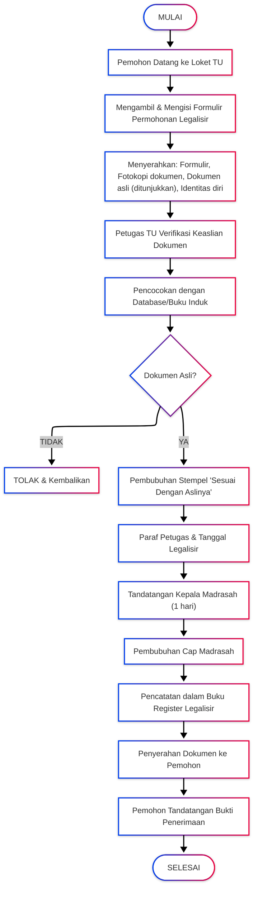

# PELAYANAN LEGALISIR IJAZAH

<!-- FIXME: Pemadanan data -->

[Menggunakan dokumen yang sudah diberikan sebelumnya]

|                       |                                                                                                         |
| --------------------- | ------------------------------------------------------------------------------------------------------- |
| **Kode SOP**          | SOP/AKD/006                                                                                             |
| **Tanggal Pembuatan** | 2 Januari 2025                                                                                          |
| **Tanggal Revisi**    | -                                                                                                       |
| **Tanggal Efektif**   | 2 Januari 2025                                                                                          |
| **Disahkan oleh**     | Kepala MTs Negeri 1 Pandeglang                                                                          |
| **Nama Prosedur**     | Pelayanan Legalisir Ijazah dan Dokumen                                                                  |
| **Dasar Hukum**       | 1. UU No. 20 Tahun 2003 tentang Sisdiknas<br>2. Permendikbud No. 18 Tahun 2016<br>3. SK Kepala Madrasah |

---

## 1. TUJUAN

- Memberikan pelayanan legalisir dokumen yang cepat dan akurat
- Menjamin keaslian dokumen yang dikeluarkan madrasah
- Memudahkan alumni dalam pengurusan keperluan administrasi
- Mencegah pemalsuan dokumen

## 2. RUANG LINGKUP

SOP ini berlaku untuk:

- Legalisir Ijazah MTs
- Legalisir Surat Keterangan Hasil Ujian Nasional (SKHUN)
- Legalisir Rapor
- Legalisir Sertifikat/Piagam
- Legalisir dokumen resmi lainnya yang dikeluarkan madrasah

## 3. DEFINISI

- **Legalisir**: Proses pengesahan fotokopi dokumen agar memiliki kekuatan hukum sama dengan dokumen asli
- **Dokumen Asli**: Dokumen yang langsung dikeluarkan oleh madrasah
- **Pemohon**: Alumni atau pihak yang berwenang mewakili alumni

## 4. PENANGGUNG JAWAB

- **Kepala Madrasah**: Pengesahan legalisir
- **Kepala TU**: Koordinator pelayanan legalisir
- **Staf TU**: Verifikator dan pelaksana teknis

---

## 5. JENIS LAYANAN LEGALISIR

### A. LEGALISIR IJAZAH

**Persyaratan:**

1. Fotokopi ijazah yang akan dilegalisir (sesuai kebutuhan)
2. Ijazah asli (untuk ditunjukkan/dicocokkan)
3. Kartu identitas pemohon (KTP/KK)
4. Surat kuasa (jika diwakilkan) + KTP pemberi kuasa

**Prosedur:**

| No  | Kegiatan                                                                                                                                                         | Pelaksana       | Waktu    | Keterangan                       |
| --- | ---------------------------------------------------------------------------------------------------------------------------------------------------------------- | --------------- | -------- | -------------------------------- |
| 1   | Pemohon datang ke loket TU dengan membawa dokumen lengkap                                                                                                        | Pemohon         | 5 menit  | -                                |
| 2   | Mengisi formulir permohonan legalisir                                                                                                                            | Pemohon         | 10 menit | Formulir tersedia di TU          |
| 3   | Menyerahkan berkas ke petugas TU                                                                                                                                 | Pemohon         | 5 menit  | -                                |
| 4   | Petugas memeriksa keaslian ijazah dengan mencocokkan:<br>- Nomor seri ijazah<br>- Nama dan data siswa<br>- Tandatangan Kepala Madrasah<br>- Cap/stempel madrasah | Staf TU         | 15 menit | Cek buku induk & arsip           |
| 5   | Petugas mencocokkan dengan database/buku induk siswa                                                                                                             | Staf TU         | 10 menit | -                                |
| 6   | Jika data sesuai, petugas membubuhkan:<br>- Paraf petugas<br>- Stempel "Sesuai Dengan Aslinya"<br>- Tanggal legalisir                                            | Staf TU         | 5 menit  | -                                |
| 7   | Kepala Madrasah menandatangani dan membubuhkan cap                                                                                                               | Kepala Madrasah | 1 hari   | Tergantung ketersediaan          |
| 8   | Pencatatan dalam buku register legalisir                                                                                                                         | Staf TU         | 5 menit  | Nomor urut legalisir             |
| 9   | Penyerahan dokumen yang sudah dilegalisir                                                                                                                        | Staf TU         | 5 menit  | Pemohon tandatangan bukti terima |

**Waktu Penyelesaian:** 1-2 hari kerja  
**Biaya:** GRATIS

---

### B. LEGALISIR SKHUN (Surat Keterangan Hasil Ujian Nasional)

**Persyaratan:**

1. Fotokopi SKHUN yang akan dilegalisir
2. SKHUN asli (untuk ditunjukkan)
3. Kartu identitas pemohon
4. Surat kuasa (jika diwakilkan)

**Prosedur:**
Sama dengan prosedur legalisir ijazah (poin A)

**Waktu Penyelesaian:** 1-2 hari kerja  
**Biaya:** GRATIS

---

### C. LEGALISIR RAPOR

**Persyaratan:**

1. Fotokopi rapor lengkap (semester 1-6) yang akan dilegalisir
2. Rapor asli (untuk ditunjukkan)
3. Kartu identitas pemohon
4. Surat kuasa (jika diwakilkan)

**Prosedur:**

| No  | Kegiatan                                               | Pelaksana       | Waktu    | Keterangan             |
| --- | ------------------------------------------------------ | --------------- | -------- | ---------------------- |
| 1   | Pemohon mengisi formulir permohonan                    | Pemohon         | 10 menit | -                      |
| 2   | Menyerahkan berkas lengkap                             | Pemohon         | 5 menit  | -                      |
| 3   | Verifikasi keaslian rapor                              | Staf TU         | 20 menit | Cek dengan arsip nilai |
| 4   | Pencocokan dengan leger nilai                          | Staf TU         | 15 menit | -                      |
| 5   | Pembubuhan stempel dan paraf pada setiap halaman rapor | Staf TU         | 15 menit | Setiap halaman nilai   |
| 6   | Penandatanganan oleh Kepala Madrasah                   | Kepala Madrasah | 1 hari   | -                      |
| 7   | Pencatatan dan penyerahan                              | Staf TU         | 10 menit | -                      |

**Waktu Penyelesaian:** 2-3 hari kerja  
**Biaya:** GRATIS

---

### D. LEGALISIR SERTIFIKAT/PIAGAM PRESTASI

**Persyaratan:**

1. Fotokopi sertifikat/piagam yang akan dilegalisir
2. Sertifikat asli (untuk ditunjukkan)
3. Kartu identitas pemohon

**Prosedur:**
Sama dengan prosedur legalisir ijazah dengan tambahan pengecekan pada arsip prestasi siswa

**Waktu Penyelesaian:** 1-2 hari kerja  
**Biaya:** GRATIS

---

## 6. KETENTUAN KHUSUS

### A. Jumlah Maksimal Legalisir per Pemohon:

- Legalisir Ijazah/SKHUN: maksimal 10 lembar per kunjungan
- Legalisir Rapor: maksimal 3 set per kunjungan
- Legalisir Sertifikat: maksimal 5 dokumen per kunjungan

### B. Legalisir Massal (Institusi/Perusahaan):

- Harus mengajukan surat permohonan resmi minimal 7 hari sebelumnya
- Melampirkan daftar nama alumni yang dokumennya akan dilegalisir
- Koordinasi dengan Kepala TU untuk jadwal pengerjaan

### C. Penolakan Legalisir:

Legalisir dapat ditolak jika:

1. Dokumen yang diajukan bukan asli/palsu
2. Data tidak sesuai dengan arsip madrasah
3. Pemohon tidak dapat menunjukkan dokumen asli
4. Dokumen rusak/tidak terbaca
5. Alumni bukan lulusan MTs Negeri 1 Pandeglang

---

## 7. DIAGRAM ALUR PELAYANAN



---

## 8. JAM PELAYANAN

**Hari Kerja:**

- Senin - Kamis: 08.00 - 14.30 WIB
- Jumat: 08.00 - 10.30 WIB
- Sabtu: 08.00 - 12.00 WIB

**Istirahat:**

- 10.00 - 10.15 WIB
- 12.00 - 13.00 WIB (Senin-Kamis)

**Catatan:**

- Pengambilan dokumen yang sudah jadi dapat dilakukan pada hari berikutnya
- Untuk legalisir mendadak dapat dikonsultasikan dengan Kepala TU

---

## 9. CONTOH STEMPEL LEGALISIR

```
┌─────────────────────────────────┐
│   SESUAI DENGAN ASLINYA         │
│                                 │
│   Telah dicocokkan dengan       │
│   dokumen asli dan data         │
│   yang tersimpan                │
│                                 │
│   Pandeglang, [Tanggal]         │
│                                 │
│   Kepala Madrasah               │
│                                 │
│                                 │
│   H. EMAN SULAIMAN, S.Ag., M.Pd.│
│   NIP. 197006032000031002       │
│                                 │
│   [CAP MADRASAH]                │
└─────────────────────────────────┘
```

---

## 10. LOKASI PELAYANAN

**Loket Tata Usaha (TU)**  
MTs Negeri 1 Pandeglang  
Jl. [Alamat Lengkap]  
Telp/WA: [Nomor Kontak]  
Email: tu@mtsn1pandeglang.sch.id

---

## 11. PENCATATAN DAN DOKUMENTASI

### Buku Register Legalisir:

| No  | Tanggal    | Nama Pemohon   | Jenis Dokumen | Jumlah   | Nomor Ijazah/SKHUN | Tahun Lulus | Tanda Tangan |
| --- | ---------- | -------------- | ------------- | -------- | ------------------ | ----------- | ------------ |
| 1   | 03/01/2025 | Ahmad Fauzi    | Ijazah        | 3 lembar | MTs.12.01/001/2023 | 2023        | (...)        |
| 2   | 03/01/2025 | Siti Nurhaliza | SKHUN         | 2 lembar | 001/MTs/2023       | 2023        | (...)        |

### Dokumen yang Disimpan:

1. Formulir permohonan legalisir (arsip 2 tahun)
2. Fotokopi identitas pemohon (arsip 1 tahun)
3. Buku register legalisir (arsip permanen)
4. Laporan bulanan pelayanan legalisir (arsip 3 tahun)

---

## 12. HAK DAN KEWAJIBAN

### Hak Pemohon:

- Mendapat pelayanan yang ramah dan profesional
- Mendapat informasi yang jelas tentang prosedur
- Mendapat dokumen legalisir yang sah
- Mengajukan keberatan jika ditolak dengan alasan tidak jelas

### Kewajiban Pemohon:

- Membawa dokumen asli untuk dicocokkan
- Mengisi formulir dengan benar dan jujur
- Menjaga kesopanan dan ketertiban
- Menerima dokumen dan menandatangani bukti penerimaan

---

## 13. PENGADUAN DAN INFORMASI

Untuk informasi lebih lanjut atau pengaduan, hubungi:

- **Kepala TU**: [Nama] - +62 8953-5185-6267
- **Email**: pengaduan@mtsn1pandeglang.sch.id
- **WhatsApp**: [Nomor WA Pengaduan]
- **Website**: www.mtsn1pandeglang.sch.id

Pengaduan akan ditindaklanjuti maksimal 2x24 jam.

---

## 14. PENUTUP

SOP ini berlaku sejak tanggal ditetapkan dan akan dievaluasi setiap tahun atau sewaktu-waktu bila diperlukan penyesuaian.

---

Ditetapkan di: Pandeglang  
Pada Tanggal: 2 Januari 2025

**Kepala MTs Negeri 1 Pandeglang**

**H. EMAN SULAIMAN, S.Ag., M.Pd.**  
NIP. 197006032000031002
