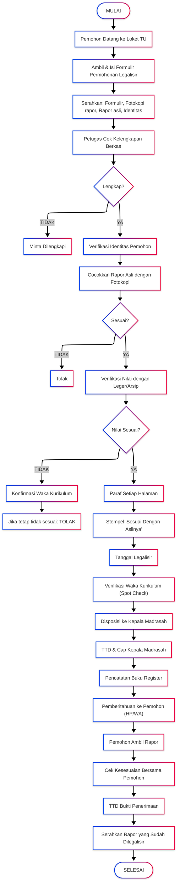

# PELAYANAN LEGALISIR RAPOR

|                       |                                                                                       |
| --------------------- | ------------------------------------------------------------------------------------- |
| **Kode SOP**          | SOP/AKD/007                                                                           |
| **Tanggal Pembuatan** | 2 Januari 2025                                                                        |
| **Tanggal Revisi**    | -                                                                                     |
| **Tanggal Efektif**   | 2 Januari 2025                                                                        |
| **Disahkan oleh**     | Kepala MTs Negeri 1 Pandeglang                                                        |
| **Nama Prosedur**     | Pelayanan Legalisir Rapor                                                             |
| **Dasar Hukum**       | 1. UU No. 20 Tahun 2003<br>2. Permendikbud No. 18 Tahun 2016<br>3. SK Kepala Madrasah |

---

## 1. TUJUAN

- Memberikan layanan legalisir rapor yang cepat dan akurat
- Menjamin keaslian nilai rapor siswa/alumni
- Memudahkan siswa/alumni dalam pendaftaran sekolah lanjutan atau keperluan lainnya
- Mencegah pemalsuan nilai rapor

## 2. RUANG LINGKUP

SOP ini berlaku untuk:

- Legalisir rapor siswa aktif (kelas VII, VIII, IX)
- Legalisir rapor alumni
- Legalisir rapor lengkap (semester 1-6)
- Legalisir rapor sebagian (semester tertentu saja)

## 3. DEFINISI

- **Rapor**: Buku laporan hasil belajar siswa per semester
- **Legalisir Rapor**: Pengesahan fotokopi rapor agar memiliki kekuatan hukum sama dengan aslinya
- **Leger Nilai**: Buku induk nilai siswa yang disimpan madrasah
- **Rapor Lengkap**: Rapor dari semester 1 sampai semester 6

## 4. PENANGGUNG JAWAB

- **Kepala Madrasah**: Pengesahan legalisir
- **Wakil Kepala Kurikulum**: Verifikasi nilai
- **Kepala TU**: Koordinator pelayanan
- **Staf TU**: Pelaksana teknis

---

## 5. JENIS LAYANAN LEGALISIR RAPOR

### A. LEGALISIR RAPOR LENGKAP (Semester 1-6)

**Keperluan:**

- Pendaftaran SMA/MA/SMK
- Pendaftaran beasiswa
- Persyaratan orang tua melamar kerja
- Dan keperluan lainnya

**Persyaratan:**

1. Formulir permohonan legalisir
2. Fotokopi rapor lengkap yang akan dilegalisir (1-3 set)
3. Rapor asli (untuk dicocokkan)
4. Fotokopi ijazah (untuk alumni)
5. Kartu identitas pemohon (KTP/KK/Kartu Pelajar)
6. Surat kuasa (jika diwakilkan) + KTP pemberi kuasa

**Prosedur:**

| No  | Kegiatan                                               | Pelaksana       | Waktu    | Keterangan                   |
| --- | ------------------------------------------------------ | --------------- | -------- | ---------------------------- |
| 1   | Pemohon datang ke loket TU                             | Pemohon         | 5 menit  | Bawa dokumen lengkap         |
| 2   | Mengambil dan mengisi formulir permohonan              | Pemohon         | 10 menit | Isi dengan lengkap           |
| 3   | Menyerahkan berkas ke petugas TU                       | Pemohon         | 5 menit  | Formulir + dokumen           |
| 4   | Petugas menerima dan mengecek kelengkapan              | Staf TU         | 10 menit | Checklist persyaratan        |
| 5   | Verifikasi identitas pemohon                           | Staf TU         | 5 menit  | Cek KTP/kartu pelajar        |
| 6   | Pencocokan rapor asli dengan fotokopi                  | Staf TU         | 15 menit | Per semester                 |
| 7   | Verifikasi nilai dengan leger di arsip                 | Staf TU         | 30 menit | Dari buku leger              |
| 8   | Jika ditemukan perbedaan, konfirmasi ke Waka Kurikulum | Staf TU         | 1 hari   | Pengecekan ulang             |
| 9   | Jika sesuai, pembubuhan paraf pada setiap halaman      | Staf TU         | 20 menit | Setiap halaman nilai         |
| 10  | Pembubuhan stempel "Sesuai Dengan Aslinya"             | Staf TU         | 10 menit | Setiap halaman               |
| 11  | Pencantuman tanggal legalisir                          | Staf TU         | 5 menit  | -                            |
| 12  | Verifikasi akhir oleh Waka Kurikulum                   | Waka Kurikulum  | 1 hari   | Spot check                   |
| 13  | Disposisi ke Kepala Madrasah untuk TTD                 | Kepala TU       | 4 jam    | -                            |
| 14  | TTD dan cap oleh Kepala Madrasah                       | Kepala Madrasah | 1 hari   | Setiap halaman/cover         |
| 15  | Pencatatan dalam buku register                         | Staf TU         | 10 menit | Nomor urut                   |
| 16  | Pemberitahuan ke pemohon                               | Staf TU         | 5 menit  | Via HP/WA                    |
| 17  | Penyerahan rapor yang sudah dilegalisir                | Staf TU         | 10 menit | Cek ulang + TTD bukti terima |

**Waktu Penyelesaian:** 2-3 hari kerja  
**Biaya:** GRATIS

---

### B. LEGALISIR RAPOR SEBAGIAN (Semester Tertentu)

**Keperluan:**

- Keperluan khusus yang hanya membutuhkan nilai semester tertentu
- Lampiran persyaratan tertentu

**Persyaratan:**
Sama dengan legalisir rapor lengkap, hanya fotokopi rapor sesuai semester yang dibutuhkan

**Prosedur:**
Sama dengan prosedur legalisir rapor lengkap

**Waktu Penyelesaian:** 2 hari kerja  
**Biaya:** GRATIS

---

### C. LEGALISIR RAPOR SISWA AKTIF

**Keperluan:**

- Pindah sekolah
- Beasiswa
- Keperluan orang tua
- Dan lainnya

**Persyaratan:**

1. Formulir permohonan (diketahui wali kelas)
2. Fotokopi rapor yang akan dilegalisir
3. Rapor asli (untuk dicocokkan)
4. Kartu pelajar
5. Surat pengantar dari wali kelas (untuk keperluan tertentu)

**Prosedur:**

| No  | Kegiatan                           | Pelaksana  | Waktu    | Keterangan                |
| --- | ---------------------------------- | ---------- | -------- | ------------------------- |
| 1   | Siswa konsultasi ke wali kelas     | Siswa      | 15 menit | Sampaikan keperluan       |
| 2   | Wali kelas memberikan persetujuan  | Wali Kelas | 5 menit  | Paraf formulir            |
| 3   | Siswa menyerahkan formulir ke TU   | Siswa      | 5 menit  | -                         |
| 4   | Proses verifikasi dan legalisir    | Staf TU    | 2 hari   | Sama dengan prosedur umum |
| 5   | Penyerahan ke siswa via wali kelas | Staf TU    | 5 menit  | -                         |

**Waktu Penyelesaian:** 2 hari kerja  
**Biaya:** GRATIS

---

### D. LEGALISIR RAPOR ALUMNI

**Keperluan:**

- Pendaftaran kuliah
- Melamar pekerjaan
- Syarat administrasi lainnya

**Persyaratan:**

1. Formulir permohonan
2. Fotokopi rapor lengkap
3. Rapor asli (untuk dicocokkan)
4. Fotokopi ijazah
5. KTP alumni atau orang tua
6. Surat kuasa (jika diwakilkan)

**Prosedur:**
Sama dengan legalisir rapor lengkap, dengan tambahan pengecekan tahun kelulusan di buku alumni

**Waktu Penyelesaian:** 2-3 hari kerja  
**Biaya:** GRATIS

---

## 6. KETENTUAN KHUSUS

### A. Jumlah Legalisir:

- **Per pemohon**: Maksimal 5 set rapor lengkap per kunjungan
- **Legalisir massal**: Minimal 10 orang, harus mengajukan surat permohonan 7 hari sebelumnya

### B. Cara Legalisir:

**1. Legalisir pada setiap halaman:**

- Untuk rapor yang akan digunakan sebagai persyaratan penting
- Paraf petugas + stempel + TTD Kepala Madrasah pada setiap halaman nilai

**2. Legalisir pada cover/halaman terakhir:**

- Untuk keperluan yang tidak terlalu formal
- Stempel besar + TTD Kepala Madrasah pada cover/halaman terakhir

**3. Legalisir dengan surat pengantar:**

- Untuk keperluan tertentu yang memerlukan surat resmi
- Rapor dilegalisir + dilengkapi surat pengantar berkop

### C. Format Stempel Legalisir:

```
┌────────────────────────────────┐
│    FOTOKOPI SESUAI ASLINYA     │
│                                │
│  Telah dicocokkan dengan nilai │
│  yang tersimpan di leger       │
│                                │
│  Pandeglang, [Tanggal]         │
│                                │
│  Kepala Madrasah               │
│  MTs Negeri 1 Pandeglang       │
│                                │
│  [TTD & CAP]                   │
│                                │
│  H. EMAN SULAIMAN, S.Ag., M.Pd.│
│  NIP. 197006032000031002       │
└────────────────────────────────┘
```

---

## 7. PENOLAKAN LEGALISIR

Legalisir rapor dapat ditolak jika:

1. **Rapor tidak asli atau palsu**

   - Ciri: kertas, warna, format tidak sesuai
   - Tidak ada cap madrasah yang sah
   - Tanda tangan kepala madrasah tidak sesuai

2. **Nilai tidak sesuai dengan arsip**

   - Ada perbedaan signifikan dengan leger
   - Dugaan nilai diubah/dipalsukan

3. **Rapor rusak/tidak terbaca**

   - Tulisan kabur/luntur
   - Sobek atau hilang halaman penting

4. **Pemohon tidak bisa menunjukkan rapor asli**

5. **Data siswa tidak ditemukan di arsip**
   - Bukan alumni madrasah
   - Data tidak cocok (nama, tahun lulus, dll)

**Tindakan jika Ditolak:**

- Diberikan surat penolakan dengan alasan jelas
- Diberi kesempatan klarifikasi (jika memungkinkan)
- Jika terbukti pemalsuan, dilaporkan ke pihak berwenang

---

## 8. DIAGRAM ALUR LEGALISIR RAPOR



---

## 9. JAM PELAYANAN

**Pengajuan Permohonan:**

- Senin - Kamis: 08.00 - 13.30 WIB
- Jumat: 08.00 - 10.00 WIB
- Sabtu: 08.00 - 11.00 WIB

**Pengambilan Rapor:**

- Senin - Kamis: 08.00 - 14.30 WIB
- Jumat: 08.00 - 10.30 WIB
- Sabtu: 08.00 - 12.00 WIB

**Libur:** Hari Minggu dan Tanggal Merah

---

## 10. BIAYA

**GRATIS - Tidak Ada Pungutan**

Yang gratis:

- Formulir permohonan
- Proses verifikasi
- Legalisir (paraf + stempel + TTD)
- Surat pengantar (jika diperlukan)

**DILARANG:**

- Pungutan dengan dalang apapun
- Percaloan/perantara
- Biaya tambahan untuk percepatan

---

## 11. PENCATATAN DAN PELAPORAN

### A. Buku Register Legalisir Rapor:

| No  | Tanggal  | Nama Pemohon  | Status        | Keperluan  | Semester | Jumlah Set | TTD Penerima |
| --- | -------- | ------------- | ------------- | ---------- | -------- | ---------- | ------------ |
| 1   | 08/01/25 | Rina Wati     | Alumni (2024) | Daftar SMA | 1-6      | 3 set      | (...)        |
| 2   | 08/01/25 | Budi (VIII-A) | Siswa Aktif   | Beasiswa   | 1-4      | 2 set      | (...)        |

### B. Laporan Bulanan:

Kepada Kepala Madrasah:

- Jumlah legalisir rapor per bulan
- Distribusi: siswa aktif vs alumni
- Keperluan terbanyak
- Kendala yang dihadapi
- Waktu rata-rata penyelesaian

### C. Arsip:

1. **Formulir permohonan**: Disimpan 1 tahun
2. **Buku register**: Permanen
3. **Fotokopi rapor** (jika ada): 6 bulan

---

## 12. HAL PENTING

### ✅ YANG HARUS DIPERHATIKAN:

**Bagi Petugas:**

- Teliti dalam mencocokkan nilai (setiap mata pelajaran)
- Cek tanda tangan dan cap asli madrasah
- Jangan ragu menolak jika ada keraguan
- Legalisir pada setiap halaman untuk keperluan penting

**Bagi Pemohon:**

- Bawa rapor asli untuk dicocokkan (tidak akan ditahan)
- Fotokopi harus jelas dan terbaca
- Sebutkan keperluan dengan jelas
- Ambil tepat waktu sesuai pemberitahuan

### ❌ YANG DILARANG:

- Memalsukan nilai rapor
- Menggunakan rapor orang lain
- Menyalahgunakan rapor yang sudah dilegalisir
- Menggandakan tanpa legalisir ulang

---

## 13. TIPS UNTUK PEMOHON

**Agar Proses Cepat:**

1. Fotokopi rapor dengan jelas (tidak buram/miring)
2. Datang di pagi hari (lebih sepi)
3. Siapkan dokumen lengkap
4. Hubungi via WA untuk cek kesiapan

**Yang Perlu Dibawa:**

1. Rapor asli (wajib ditunjukkan)
2. Fotokopi rapor
3. Identitas diri (KTP/KK/Kartu Pelajar)
4. Surat kuasa (jika diwakilkan)

**Hal yang Sering Ditanyakan:**

**Q: Apakah rapor asli ditahan?**
A: Tidak, hanya dicocokkan lalu dikembalikan

**Q: Berapa lama prosesnya?**
A: 2-3 hari kerja

**Q: Apakah bisa diwakilkan?**
A: Bisa, dengan surat kuasa + KTP pemberi kuasa

**Q: Apakah bisa legalisir rapor fotokopian lama?**
A: Bisa, asalkan rapor asli ditunjukkan dan nilai sesuai arsip

**Q: Kalau rapor asli hilang, bagaimana?**
A: Harus buat surat kehilangan dulu, lalu cetak rapor duplikat, baru bisa dilegalisir

---

## 14. PENANGANAN KASUS KHUSUS

### A. Rapor Rusak/Sobek:

1. Pemohon membuat surat permohonan cetak ulang rapor
2. Staf TU cetak rapor dari arsip digital/leger
3. Dilegalisir sesuai prosedur
4. Dicantumkan keterangan: "Duplikat karena rusak"

### B. Nilai Rapor Tidak Sesuai Arsip:

1. Staf TU hitung ulang nilai dengan teliti
2. Konfirmasi ke Waka Kurikulum
3. Jika arsip madrasah yang salah: perbaiki arsip, lalu legalisir
4. Jika rapor pemohon yang salah: tolak legalisir

### C. Legalisir untuk Keperluan Luar Negeri:

1. Legalisir di madrasah (sesuai SOP ini)
2. Arahkan pemohon untuk legalisir lanjutan ke:
   - Kemenag Kabupaten
   - Kemenag Provinsi
   - Kementerian Luar Negeri (jika perlu)

---

## 15. PENGADUAN

Jika ada masalah dalam pelayanan legalisir rapor:

**Hubungi:**

- Kepala TU: [Nomor HP]
- Waka Kurikulum: [Nomor HP]
- Email: pengaduan@mtsn1pandeglang.sch.id
- Datang langsung ke ruang TU

**Komitmen:**

- Pengaduan ditanggapi maksimal 1x24 jam
- Investigasi maksimal 2 hari
- Solusi diberikan maksimal 3 hari

---

## 16. PENUTUP

SOP ini dibuat untuk memberikan pelayanan legalisir rapor yang cepat, mudah, dan gratis kepada siswa dan alumni MTs Negeri 1 Pandeglang.

---

Ditetapkan di: Pandeglang  
Pada Tanggal: 2 Januari 2025

**Kepala MTs Negeri 1 Pandeglang**

**H. EMAN SULAIMAN, S.Ag., M.Pd.**  
NIP. 197006032000031002
