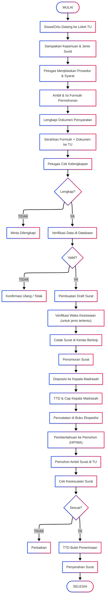

# PELAYANAN SURAT KETERANGAN SISWA

|                       |                                                                                       |
| --------------------- | ------------------------------------------------------------------------------------- |
| **Kode SOP**          | SOP/AKD/005                                                                           |
| **Tanggal Pembuatan** | 2 Januari 2025                                                                        |
| **Tanggal Revisi**    | -                                                                                     |
| **Tanggal Efektif**   | 2 Januari 2025                                                                        |
| **Disahkan oleh**     | Kepala MTs Negeri 1 Pandeglang                                                        |
| **Nama Prosedur**     | Pelayanan Surat Keterangan Siswa                                                      |
| **Dasar Hukum**       | 1. UU No. 20 Tahun 2003<br>2. Permendikbud No. 18 Tahun 2016<br>3. SK Kepala Madrasah |

---

## 1. TUJUAN

- Memberikan pelayanan pembuatan surat keterangan yang cepat dan akurat
- Membantu siswa dalam memenuhi persyaratan administrasi
- Menjamin keaslian dan keabsahan surat keterangan
- Memberikan kepastian waktu pelayanan

## 2. RUANG LINGKUP

SOP ini mengatur pembuatan berbagai jenis surat keterangan untuk siswa aktif dan alumni, meliputi:

- Surat Keterangan Siswa Aktif
- Surat Keterangan Berkelakuan Baik
- Surat Keterangan Prestasi
- Surat Keterangan Lulus (untuk alumni)
- Surat Keterangan Kehilangan
- Surat Rekomendasi
- Dan surat keterangan lainnya

## 3. DEFINISI

- **Surat Keterangan**: Dokumen resmi yang dikeluarkan madrasah untuk menerangkan status/kondisi siswa
- **Pemohon**: Siswa, alumni, atau orang tua/wali yang berhak
- **Legalisir**: Pengesahan surat keterangan oleh Kepala Madrasah

## 4. PENANGGUNG JAWAB

- **Kepala Madrasah**: Penandatangan surat keterangan
- **Wakil Kepala Kesiswaan**: Verifikator data siswa
- **Kepala TU**: Koordinator pembuatan surat
- **Staf TU**: Pelaksana teknis

---

## 5. JENIS SURAT KETERANGAN

### A. SURAT KETERANGAN SISWA AKTIF

**Keperluan:**

- Pendaftaran beasiswa
- Pembuatan KTP/paspor/visa
- Persyaratan orang tua melamar kerja
- Keperluan bank/asuransi
- Dan keperluan lainnya

**Persyaratan:**

1. Mengisi formulir permohonan
2. Fotokopi kartu pelajar
3. Menyebutkan keperluan dengan jelas

**Prosedur:**

| No  | Kegiatan                           | Pelaksana       | Waktu    | Keterangan           |
| --- | ---------------------------------- | --------------- | -------- | -------------------- |
| 1   | Siswa/ortu datang ke loket TU      | Pemohon         | 5 menit  | Sampaikan keperluan  |
| 2   | Mengisi formulir permohonan        | Pemohon         | 10 menit | Isi lengkap          |
| 3   | Menyerahkan fotokopi kartu pelajar | Pemohon         | 5 menit  | -                    |
| 4   | Staf TU menerima dan mengecek      | Staf TU         | 10 menit | Cek di database      |
| 5   | Verifikasi status siswa aktif      | Staf TU         | 15 menit | Buku induk & Dapodik |
| 6   | Pembuatan draft surat              | Staf TU         | 20 menit | Sesuai format        |
| 7   | Verifikasi oleh Waka Kesiswaan     | Waka Kesiswaan  | 30 menit | Cek kebenaran data   |
| 8   | Cetak surat di kertas berkop       | Staf TU         | 10 menit | -                    |
| 9   | Penomoran surat                    | Staf TU         | 5 menit  | Buku agenda          |
| 10  | Disposisi ke Kepala Madrasah       | Kepala TU       | 4 jam    | Untuk TTD            |
| 11  | TTD dan cap oleh Kepala Madrasah   | Kepala Madrasah | 1 hari   | Cap basah            |
| 12  | Pencatatan di buku ekspedisi       | Staf TU         | 5 menit  | Arsip                |
| 13  | Pemberitahuan ke pemohon           | Staf TU         | 5 menit  | Via HP/langsung      |
| 14  | Penyerahan surat                   | Staf TU         | 5 menit  | TTD bukti terima     |

**Waktu Penyelesaian:** 2 hari kerja  
**Biaya:** GRATIS

**Isi Surat:**

- Data siswa (nama, NIS, NISN, kelas, tahun ajaran)
- Pernyataan bahwa siswa aktif bersekolah
- Keperluan surat
- TTD Kepala Madrasah & cap

---

### B. SURAT KETERANGAN BERKELAKUAN BAIK

**Keperluan:**

- Pendaftaran pesantren/sekolah lanjutan
- Melamar pekerjaan (untuk alumni)
- Pendaftaran organisasi
- Dan keperluan lainnya

**Persyaratan:**

1. Formulir permohonan
2. Fotokopi kartu pelajar (untuk siswa aktif)
3. Fotokopi ijazah (untuk alumni)
4. Surat keterangan dari wali kelas (untuk siswa aktif)

**Prosedur:**

| No  | Kegiatan                                           | Pelaksana       | Waktu    | Keterangan              |
| --- | -------------------------------------------------- | --------------- | -------- | ----------------------- |
| 1   | Siswa mengambil formulir di TU                     | Siswa           | 5 menit  | -                       |
| 2   | Konsultasi ke wali kelas                           | Siswa           | 30 menit | Minta rekomendasi       |
| 3   | Wali kelas membuat surat keterangan kelakuan       | Wali Kelas      | 1 hari   | Cek catatan pelanggaran |
| 4   | Siswa menyerahkan formulir + surat dari wali kelas | Siswa           | 10 menit | Ke TU                   |
| 5   | Staf TU verifikasi dengan buku pelanggaran         | Staf TU         | 30 menit | Cross check             |
| 6   | Pembuatan draft surat                              | Staf TU         | 30 menit | Format resmi            |
| 7   | Verifikasi Waka Kesiswaan                          | Waka Kesiswaan  | 1 hari   | Cek catatan siswa       |
| 8   | Cetak dan penomoran                                | Staf TU         | 15 menit | -                       |
| 9   | TTD Kepala Madrasah                                | Kepala Madrasah | 1 hari   | Cap basah               |
| 10  | Penyerahan ke pemohon                              | Staf TU         | 5 menit  | TTD bukti terima        |

**Waktu Penyelesaian:** 3 hari kerja  
**Biaya:** GRATIS

**Isi Surat:**

- Data siswa lengkap
- Pernyataan berkelakuan baik selama bersekolah
- Catatan prestasi (jika ada)
- Catatan: "Tidak pernah terlibat pelanggaran berat"
- TTD Kepala Madrasah & cap

**Catatan:**

- Jika siswa pernah melakukan pelanggaran sedang/berat, akan dicantumkan dalam surat
- Jika pelanggaran sangat berat, surat tidak dapat diterbitkan

---

### C. SURAT KETERANGAN PRESTASI

**Keperluan:**

- Pendaftaran beasiswa prestasi
- Portofolio siswa
- Pendaftaran sekolah lanjutan jalur prestasi
- Dan keperluan lainnya

**Persyaratan:**

1. Formulir permohonan
2. Fotokopi kartu pelajar
3. Fotokopi piagam/sertifikat prestasi (asli untuk ditunjukkan)
4. Surat keterangan prestasi dari pembina (jika prestasi ekstrakurikuler)

**Prosedur:**

| No  | Kegiatan                                            | Pelaksana       | Waktu    | Keterangan                |
| --- | --------------------------------------------------- | --------------- | -------- | ------------------------- |
| 1   | Siswa mengisi formulir                              | Siswa           | 10 menit | -                         |
| 2   | Menyerahkan fotokopi piagam + asli untuk dicocokkan | Siswa           | 15 menit | Ke TU                     |
| 3   | Staf TU verifikasi keaslian piagam                  | Staf TU         | 30 menit | Cek dengan arsip prestasi |
| 4   | Konfirmasi ke pembina/guru pendamping (jika perlu)  | Staf TU         | 1 hari   | Via telepon/langsung      |
| 5   | Pembuatan draft surat                               | Staf TU         | 30 menit | Listing prestasi          |
| 6   | Verifikasi Waka Kesiswaan                           | Waka Kesiswaan  | 1 hari   | -                         |
| 7   | Cetak dan penomoran                                 | Staf TU         | 15 menit | -                         |
| 8   | TTD Kepala Madrasah                                 | Kepala Madrasah | 1 hari   | Cap basah                 |
| 9   | Penyerahan                                          | Staf TU         | 5 menit  | TTD bukti terima          |

**Waktu Penyelesaian:** 3 hari kerja  
**Biaya:** GRATIS

**Isi Surat:**

- Data siswa
- Daftar prestasi yang pernah diraih:
  - Nama lomba/kejuaraan
  - Tingkat (sekolah/kecamatan/kabupaten/provinsi/nasional)
  - Peringkat/juara
  - Tahun perolehan
- TTD Kepala Madrasah & cap

---

### D. SURAT KETERANGAN LULUS (UNTUK ALUMNI)

**Keperluan:**

- Sambil menunggu ijazah terbit
- Pendaftaran sekolah lanjutan
- Melamar pekerjaan
- Dan keperluan lainnya

**Persyaratan:**

1. Formulir permohonan
2. Fotokopi SKHUN
3. Fotokopi KTP/KK
4. Bukti kelulusan (pengumuman/screenshoot)

**Prosedur:**

| No  | Kegiatan                            | Pelaksana       | Waktu    | Keterangan           |
| --- | ----------------------------------- | --------------- | -------- | -------------------- |
| 1   | Alumni/ortu mengisi formulir        | Pemohon         | 10 menit | -                    |
| 2   | Menyerahkan persyaratan             | Pemohon         | 10 menit | Ke TU                |
| 3   | Staf TU cek data kelulusan di arsip | Staf TU         | 30 menit | Buku kelulusan       |
| 4   | Verifikasi nilai UN/Ujian Akhir     | Staf TU         | 30 menit | Leger nilai          |
| 5   | Pembuatan draft surat               | Staf TU         | 30 menit | Cantumkan nilai      |
| 6   | Verifikasi Waka Kurikulum           | Waka Kurikulum  | 1 hari   | Cek keakuratan nilai |
| 7   | Cetak dan penomoran                 | Staf TU         | 15 menit | -                    |
| 8   | TTD Kepala Madrasah                 | Kepala Madrasah | 1 hari   | Cap basah            |
| 9   | Penyerahan                          | Staf TU         | 5 menit  | TTD bukti terima     |

**Waktu Penyelesaian:** 3 hari kerja  
**Biaya:** GRATIS

**Isi Surat:**

- Data alumni
- Tahun lulus
- Nilai rata-rata rapor dan nilai UN (jika ada)
- Keterangan: "Ijazah sedang dalam proses"
- Masa berlaku surat (biasanya 3 bulan atau sampai ijazah terbit)
- TTD Kepala Madrasah & cap

---

### E. SURAT KETERANGAN KEHILANGAN

**Keperluan:**

- Kehilangan kartu pelajar
- Kehilangan rapor
- Kehilangan dokumen lain dari madrasah

**Persyaratan:**

1. Formulir kehilangan
2. Surat keterangan kehilangan dari RT/RW atau Kepolisian (jika kehilangan di luar sekolah)
3. Fotokopi KK
4. Surat pernyataan bermaterai dari orang tua

**Prosedur:**

| No  | Kegiatan                                   | Pelaksana       | Waktu        | Keterangan          |
| --- | ------------------------------------------ | --------------- | ------------ | ------------------- |
| 1   | Siswa melapor kehilangan ke wali kelas     | Siswa           | 15 menit     | Kronologi kejadian  |
| 2   | Wali kelas membuat berita acara kehilangan | Wali Kelas      | 30 menit     | -                   |
| 3   | Siswa mengisi formulir di TU               | Siswa           | 10 menit     | -                   |
| 4   | Melampirkan surat kehilangan RT/RW/Polisi  | Siswa           | -            | Jika hilang di luar |
| 5   | Staf TU verifikasi laporan                 | Staf TU         | 30 menit     | -                   |
| 6   | Pembuatan surat keterangan kehilangan      | Staf TU         | 30 menit     | -                   |
| 7   | Verifikasi Waka Kesiswaan                  | Waka Kesiswaan  | 1 hari       | -                   |
| 8   | TTD Kepala Madrasah                        | Kepala Madrasah | 1 hari       | -                   |
| 9   | Penyerahan + pengurusan dokumen pengganti  | Staf TU         | Sesuai jenis | -                   |

**Waktu Penyelesaian:** 2 hari kerja  
**Biaya:** GRATIS (untuk surat keterangan), biaya pengganti dokumen sesuai ketentuan

---

### F. SURAT REKOMENDASI

**Keperluan:**

- Pendaftaran beasiswa
- Melamar pekerjaan (alumni)
- Pendaftaran program khusus
- Dan keperluan lainnya

**Persyaratan:**

1. Formulir permohonan
2. Fotokopi kartu pelajar/ijazah
3. CV/portofolio (untuk mengetahui latar belakang)
4. Surat dari lembaga yang meminta rekomendasi (jika ada)

**Prosedur:**

| No  | Kegiatan                                   | Pelaksana       | Waktu    | Keterangan              |
| --- | ------------------------------------------ | --------------- | -------- | ----------------------- |
| 1   | Siswa konsultasi dengan wali kelas/guru BK | Siswa           | 30 menit | Diskusi keperluan       |
| 2   | Mengisi formulir permohonan                | Siswa           | 15 menit | -                       |
| 3   | Menyerahkan portofolio/prestasi            | Siswa           | 10 menit | Untuk bahan rekomendasi |
| 4   | Wali kelas/Guru membuat draft rekomendasi  | Wali Kelas      | 1 hari   | Isi sesuai keperluan    |
| 5   | Staf TU merapikan format resmi             | Staf TU         | 1 jam    | Kertas berkop           |
| 6   | Verifikasi Waka Kesiswaan                  | Waka Kesiswaan  | 1 hari   | -                       |
| 7   | TTD Kepala Madrasah                        | Kepala Madrasah | 1-2 hari | -                       |
| 8   | Penyerahan                                 | Staf TU         | 5 menit  | TTD bukti terima        |

**Waktu Penyelesaian:** 4-5 hari kerja  
**Biaya:** GRATIS

**Isi Surat:**

- Data siswa/alumni
- Prestasi akademik dan non-akademik
- Karakter dan kepribadian
- Rekomendasi untuk keperluan yang diminta
- TTD Kepala Madrasah & cap

---

### G. SURAT IZIN TIDAK MASUK SEKOLAH

**Keperluan:**

- Sakit
- Keperluan keluarga
- Acara penting

**Persyaratan:**

1. Surat permohonan izin dari orang tua
2. Surat keterangan dokter (jika sakit lebih dari 3 hari)
3. Bukti pendukung lainnya (jika ada)

**Prosedur:**

| No  | Kegiatan                             | Pelaksana  | Waktu    | Keterangan              |
| --- | ------------------------------------ | ---------- | -------- | ----------------------- |
| 1   | Orang tua membuat surat izin         | Ortu       | 15 menit | Tulis tangan/ketik      |
| 2   | Menyerahkan ke wali kelas            | Ortu/Siswa | 5 menit  | Langsung/via siswa lain |
| 3   | Wali kelas mencatat di buku izin     | Wali Kelas | 5 menit  | -                       |
| 4   | Konfirmasi ke orang tua (jika perlu) | Wali Kelas | 10 menit | Via telepon             |
| 5   | Izin diberikan/ditolak               | Wali Kelas | 5 menit  | Sesuai alasan           |

**Catatan:**

- Izin sakit >3 hari harus ada surat dokter
- Izin tidak boleh saat ulangan/ujian kecuali emergency
- Surat izin disimpan oleh wali kelas

---

## 6. PERSYARATAN UMUM SEMUA JENIS SURAT

1. **Formulir permohonan** diisi lengkap dan jelas
2. **Identitas pemohon** (kartu pelajar/KTP/KK)
3. **Menyebutkan keperluan** dengan jelas dan spesifik
4. **Dokumen pendukung** sesuai jenis surat yang diminta

---

## 7. WAKTU PENYELESAIAN

| Jenis Surat                  | Waktu Normal   | Waktu Kilat\* |
| ---------------------------- | -------------- | ------------- |
| Surat Keterangan Siswa Aktif | 2 hari kerja   | 4 jam         |
| Surat Berkelakuan Baik       | 3 hari kerja   | 1 hari        |
| Surat Keterangan Prestasi    | 3 hari kerja   | 1 hari        |
| Surat Keterangan Lulus       | 3 hari kerja   | 1 hari        |
| Surat Kehilangan             | 2 hari kerja   | 4 jam         |
| Surat Rekomendasi            | 4-5 hari kerja | 2 hari        |

**Layanan Kilat:** Dengan pertimbangan kepala TU untuk keperluan mendesak (tidak dipungut biaya tambahan)

---

## 8. DIAGRAM ALUR PELAYANAN SURAT KETERANGAN



---

## 9. BIAYA

**Prinsip: SEMUA SURAT KETERANGAN GRATIS**

Tidak ada pungutan untuk:

- Formulir permohonan
- Proses pembuatan surat
- Legalisir tanda tangan Kepala Madrasah
- Layanan kilat (untuk keperluan mendesak)

**Yang Dilarang:**

- Percaloan/perantara pembuatan surat
- Pungutan liar dengan dalih apapun

---

## 10. JAM PELAYANAN

**Pengajuan Permohonan:**

- Senin - Kamis: 08.00 - 14.00 WIB
- Jumat: 08.00 - 10.00 WIB
- Sabtu: 08.00 - 11.30 WIB

**Pengambilan Surat:**

- Senin - Kamis: 08.00 - 14.30 WIB
- Jumat: 08.00 - 10.30 WIB
- Sabtu: 08.00 - 12.00 WIB

**Istirahat:**

- 10.00 - 10.15 WIB (istirahat 1)
- 12.00 - 13.00 WIB (ishoma, Senin-Kamis)

---

## 11. LOKASI PELAYANAN

**Loket Tata Usaha (TU)**
MTs Negeri 1 Pandeglang
Jl. [Alamat Lengkap]
Telp: [Nomor Telepon]
WhatsApp: [Nomor WA]
Email: tu@mtsn1pandeglang.sch.id

**Kontak Person:**

- Kepala TU: [Nama] - [Nomor HP]
- Staf TU Bagian Surat-Menyurat: [Nama] - [Nomor HP]

---

## 12. FORMAT SURAT KETERANGAN

**Kop Surat:**

```
KEMENTERIAN AGAMA REPUBLIK INDONESIA
KANTOR KEMENTERIAN AGAMA KABUPATEN PANDEGLANG
MTs NEGERI 1 PANDEGLANG
Jl. [Alamat Lengkap]
Telp: [Nomor] Email: [Email]
Website: [Website]
```

**Isi Surat:**

- Nomor: [Nomor]/SK-[Jenis]/MTsN1-PDG/[Bulan romawi]/[Tahun]
- Lampiran: - (atau sesuai kebutuhan)
- Perihal: Surat Keterangan [Jenis]
- Yang bertanda tangan di bawah ini:
  - Nama: H. EMAN SULAIMAN, S.Ag., M.Pd.
  - NIP: 197006032000031002
  - Jabatan: Kepala MTs Negeri 1 Pandeglang
- Menerangkan bahwa:
  - [Data siswa/alumni]
- [Isi keterangan sesuai jenis surat]
- Demikian surat keterangan ini dibuat untuk dipergunakan sebagaimana mestinya.
- Tempat, Tanggal
- TTD & Cap
- Nama Kepala Madrasah
- NIP

---

## 13. PENCATATAN DAN ARSIP

### A. Buku Register Surat Keterangan:

| No  | Tanggal  | Nomor Surat   | Nama Pemohon | Jenis Surat | Keperluan | Tgl Selesai | TTD Penerima |
| --- | -------- | ------------- | ------------ | ----------- | --------- | ----------- | ------------ |
| 1   | 05/01/25 | 001/SK-SA/... | Ahmad Rizki  | Siswa Aktif | Beasiswa  | 07/01/25    | (...)        |

### B. Arsip:

1. **Arsip Formulir Permohonan** - Disimpan 1 tahun
2. **Arsip Fotokopi Surat** - Disimpan 2 tahun
3. **Database Digital** - Backup rutin

### C. Pelaporan:

**Laporan Bulanan ke Kepala Madrasah:**

- Jumlah surat keterangan yang diterbitkan
- Jenis surat terbanyak
- Waktu rata-rata penyelesaian
- Kendala dan solusi

---

## 14. HAK DAN KEWAJIBAN

### Hak Pemohon:

- Mendapat informasi jelas tentang prosedur
- Mendapat pelayanan cepat sesuai waktu yang dijanjikan
- Mendapat surat yang sah dan akurat
- Mengajukan keberatan jika ada kesalahan

### Kewajiban Pemohon:

- Mengisi formulir dengan benar dan lengkap
- Menyerahkan dokumen yang sah
- Mengambil surat tepat waktu
- Menggunakan surat sesuai keperluan yang diajukan

### Hak Madrasah:

- Menolak permohonan yang tidak memenuhi syarat
- Meminta klarifikasi jika data meragukan
- Membatalkan surat jika ditemukan pemalsuan

### Kewajiban Madrasah:

- Memberikan pelayanan yang ramah dan profesional
- Menyelesaikan tepat waktu
- Menjaga kerahasiaan data siswa
- Tidak memungut biaya

---

## 15. SANKSI

### Bagi Pemohon:

- **Memalsukan data/dokumen**: Surat dibatalkan, tidak dilayani selama 6 bulan
- **Menyalahgunakan surat**: Dilaporkan ke pihak berwenang

### Bagi Petugas:

- **Memungut biaya**: Sanksi sesuai peraturan kepegawaian
- **Menunda-nunda tanpa alasan**: Teguran lisan s.d. tertulis
- **Membocorkan data siswa**: Sanksi berat

---

## 16. PENOLAKAN PERMOHONAN

Permohonan dapat ditolak jika:

1. Data tidak ditemukan di arsip madrasah
2. Pemohon bukan yang berhak (bukan siswa/alumni/ortu)
3. Dokumen persyaratan palsu
4. Keperluan tidak jelas/tidak wajar
5. Siswa masih memiliki kasus pelanggaran berat yang sedang diproses

**Pemberitahuan Penolakan:**

- Disampaikan secara lisan dan tertulis
- Disertai alasan yang jelas
- Diberi kesempatan untuk melengkapi (jika memungkinkan)

---

## 17. PENGADUAN DAN SARAN

**Jika ada keluhan terkait pelayanan surat keterangan:**

**Saluran Pengaduan:**

- Kepala TU: [Nomor HP]
- Email: pengaduan@mtsn1pandeglang.sch.id
- Kotak saran di loket TU
- WhatsApp: [Nomor WA]

**Komitmen Tindak Lanjut:**

- Pengaduan akan ditanggapi maksimal 1x24 jam
- Investigasi maksimal 3 hari
- Hasil tindak lanjut disampaikan ke pengadu

---

## 18. EVALUASI PELAYANAN

### Indikator Keberhasilan:

1. **Waktu Penyelesaian**: 90% selesai tepat waktu
2. **Kepuasan Pemohon**: Minimal 85% puas
3. **Akurasi Data**: 100% akurat
4. **Pengaduan**: Maksimal 5 kasus per bulan

### Evaluasi Dilakukan:

- Bulanan: oleh Kepala TU
- Semesteran: oleh Tim Penjaminan Mutu
- Tahunan: oleh Kepala Madrasah

---

## 19. TIPS UNTUK PEMOHON

✅ **Agar Proses Cepat:**

- Datang di pagi hari (lebih sepi)
- Siapkan dokumen lengkap
- Isi formulir dengan lengkap dan jelas
- Hubungi via WA untuk cek kesiapan surat

✅ **Yang Perlu Diperhatikan:**

- Cek kembali data di surat saat menerima
- Simpan surat di tempat aman
- Gunakan sesuai keperluan

❌ **Yang Tidak Boleh:**

- Memalsukan tanda tangan/cap
- Menggandakan surat tanpa legalisir
- Menyalahgunakan untuk keperluan lain

---

## 20. PENUTUP

SOP ini dibuat untuk memberikan kepastian pelayanan yang cepat, mudah, dan gratis kepada siswa dan alumni dalam mengurus berbagai surat keterangan.

---

Ditetapkan di: Pandeglang  
Pada Tanggal: 2 Januari 2025

**Kepala MTs Negeri 1 Pandeglang**

**H. EMAN SULAIMAN, S.Ag., M.Pd.**  
NIP. 197006032000031002
