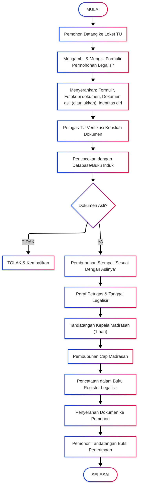

# PEMINJAMAN BUKU PERPUSTAKAAN

<!-- FIXME: Pemadanan data -->

|                       |                                                                                       |
| --------------------- | ------------------------------------------------------------------------------------- |
| **Kode SOP**          | SOP/AKD/009                                                                           |
| **Tanggal Pembuatan** | 2 Januari 2025                                                                        |
| **Tanggal Revisi**    | -                                                                                     |
| **Tanggal Efektif**   | 2 Januari 2025                                                                        |
| **Disahkan oleh**     | Kepala MTs Negeri 1 Pandeglang                                                        |
| **Nama Prosedur**     | Peminjaman Buku Perpustakaan                                                          |
| **Dasar Hukum**       | 1. UU No. 43 Tahun 2007<br>2. Permendikbud No. 23 Tahun 2015<br>3. SK Kepala Madrasah |

---

## 1. TUJUAN

- Memberikan akses mudah kepada siswa dan guru untuk meminjam buku
- Mengatur sistem peminjaman yang tertib dan terkontrol
- Menjaga kelestarian koleksi perpustakaan
- Meningkatkan pemanfaatan perpustakaan

## 2. RUANG LINGKUP

SOP ini mengatur:

- Prosedur peminjaman buku
- Prosedur pengembalian buku
- Perpanjangan masa pinjam
- Denda keterlambatan
- Penggantian buku hilang/rusak

## 3. DEFINISI

- **Peminjam**: Anggota perpustakaan yang meminjam buku
- **Masa Pinjam**: Jangka waktu yang diberikan untuk meminjam buku
- **Perpanjangan**: Penambahan masa pinjam
- **Denda**: Sanksi atas keterlambatan pengembalian
- **Buku Sirkulasi**: Buku yang boleh dipinjam dibawa pulang
- **Buku Referensi**: Buku yang hanya boleh dibaca di perpustakaan

## 4. PENANGGUNG JAWAB

- **Kepala Perpustakaan**: Koordinator layanan sirkulasi
- **Pustakawan**: Pelaksana layanan peminjaman/pengembalian
- **Tenaga Layanan**: Pembantu layanan sirkulasi

---

## 5. JENIS BUKU

### A. Buku Sirkulasi (Boleh Dipinjam):

- Buku pelajaran (non-paket)
- Buku fiksi (novel, cerpen, komik edukatif)
- Buku pengetahuan umum
- Majalah lama (>3 bulan)

### B. Buku Referensi (Tidak Boleh Dipinjam):

- Ensiklopedi
- Kamus
- Atlas
- Buku langka/antik
- Buku referensi khusus
- Majalah terbaru
- Skripsi/karya ilmiah

**Tanda:** Buku referensi diberi label khusus "REFERENSI - TIDAK BOLEH DIPINJAM"

---

## 6. KETENTUAN PEMINJAMAN

### A. Syarat Peminjam:

1. Terdaftar sebagai anggota perpustakaan
2. Membawa kartu anggota perpustakaan
3. Tidak memiliki tunggakan pinjaman
4. Tidak dalam masa skorsing

### B. Kuota Peminjaman:

| Kategori Anggota                             | Jumlah Buku | Masa Pinjam                      |
| -------------------------------------------- | ----------- | -------------------------------- |
| **Siswa**                                    | 3 buku      | 1 minggu (7 hari)                |
| **Guru/Karyawan**                            | 5 buku      | 2 minggu (14 hari)               |
| **Pinjaman Khusus** (untuk tugas/penelitian) | 10 buku     | 1 bulan (dengan surat pengantar) |

### C. Perpanjangan:

- Dapat diperpanjang **1 kali**
- Masa perpanjangan: sama dengan masa pinjam awal
- Syarat: tidak ada yang memesan buku tersebut
- Cara: Datang langsung atau via WhatsApp perpustakaan

---

## 7. PROSEDUR PEMINJAMAN BUKU

| No  | Kegiatan                                         | Pelaksana  | Waktu        | Keterangan                           |
| --- | ------------------------------------------------ | ---------- | ------------ | ------------------------------------ |
| 1   | Peminjam datang ke perpustakaan                  | Peminjam   | -            | Bawa kartu anggota                   |
| 2   | Mencari buku yang diinginkan                     | Peminjam   | 10-30 menit  | Lihat katalog/rak                    |
| 3   | Membawa buku ke meja sirkulasi                   | Peminjam   | 2 menit      | Maksimal sesuai kuota                |
| 4   | Menunjukkan kartu anggota                        | Peminjam   | 1 menit      | -                                    |
| 5   | Petugas mengecek status anggota                  | Pustakawan | 2 menit      | Cek di sistem: tunggakan, skorsing   |
| 6   | Status OK?                                       | Pustakawan | -            | Jika ada masalah, tidak boleh pinjam |
|     | ↓ YA                                             |            |              |                                      |
| 7   | Petugas scan barcode buku (atau catat manual)    | Pustakawan | 1 menit/buku | Input ke sistem                      |
| 8   | Sistem mencatat:                                 | Pustakawan | Otomatis     | -                                    |
|     | - Nomor anggota                                  |            |              |                                      |
|     | - Nomor buku                                     |            |              |                                      |
|     | - Tanggal pinjam                                 |            |              |                                      |
|     | - Tanggal harus kembali                          |            |              |                                      |
| 9   | Cetak slip peminjaman (atau tulis di kartu buku) | Pustakawan | 1 menit      | Diberikan ke peminjam                |
| 10  | Peminjam menandatangani bukti pinjam             | Peminjam   | 1 menit      | Di slip/buku peminjaman              |
| 11  | Petugas menaruh kartu buku di kotak peminjaman   | Pustakawan | 30 detik     | Untuk kontrol                        |
| 12  | Penyerahan buku ke peminjam                      | Pustakawan | 30 detik     | Selamat membaca!                     |

**Total Waktu:** 5-10 menit

**Slip Peminjaman** berisi:

- Nama pem**Persyaratan:**

1. Fotokopi SKHUN yang akan dilegalisir
2. SKHUN asli (untuk ditunjukkan)
3. Kartu identitas pemohon
4. Surat kuasa (jika diwakilkan)

**Prosedur:**
Sama dengan prosedur legalisir ijazah (poin A)

**Waktu Penyelesaian:** 1-2 hari kerja  
**Biaya:** GRATIS

---

### C. LEGALISIR RAPOR

**Persyaratan:**

1. Fotokopi rapor lengkap (semester 1-6) yang akan dilegalisir
2. Rapor asli (untuk ditunjukkan)
3. Kartu identitas pemohon
4. Surat kuasa (jika diwakilkan)

**Prosedur:**

| No  | Kegiatan                                               | Pelaksana       | Waktu    | Keterangan             |
| --- | ------------------------------------------------------ | --------------- | -------- | ---------------------- |
| 1   | Pemohon mengisi formulir permohonan                    | Pemohon         | 10 menit | -                      |
| 2   | Menyerahkan berkas lengkap                             | Pemohon         | 5 menit  | -                      |
| 3   | Verifikasi keaslian rapor                              | Staf TU         | 20 menit | Cek dengan arsip nilai |
| 4   | Pencocokan dengan leger nilai                          | Staf TU         | 15 menit | -                      |
| 5   | Pembubuhan stempel dan paraf pada setiap halaman rapor | Staf TU         | 15 menit | Setiap halaman nilai   |
| 6   | Penandatanganan oleh Kepala Madrasah                   | Kepala Madrasah | 1 hari   | -                      |
| 7   | Pencatatan dan penyerahan                              | Staf TU         | 10 menit | -                      |

**Waktu Penyelesaian:** 2-3 hari kerja  
**Biaya:** GRATIS

---

### D. LEGALISIR SERTIFIKAT/PIAGAM PRESTASI

**Persyaratan:**

1. Fotokopi sertifikat/piagam yang akan dilegalisir
2. Sertifikat asli (untuk ditunjukkan)
3. Kartu identitas pemohon

**Prosedur:**
Sama dengan prosedur legalisir ijazah dengan tambahan pengecekan pada arsip prestasi siswa

**Waktu Penyelesaian:** 1-2 hari kerja  
**Biaya:** GRATIS

---

## 6. KETENTUAN KHUSUS

### A. Jumlah Maksimal Legalisir per Pemohon:

- Legalisir Ijazah/SKHUN: maksimal 10 lembar per kunjungan
- Legalisir Rapor: maksimal 3 set per kunjungan
- Legalisir Sertifikat: maksimal 5 dokumen per kunjungan

### B. Legalisir Massal (Institusi/Perusahaan):

- Harus mengajukan surat permohonan resmi minimal 7 hari sebelumnya
- Melampirkan daftar nama alumni yang dokumennya akan dilegalisir
- Koordinasi dengan Kepala TU untuk jadwal pengerjaan

### C. Penolakan Legalisir:

Legalisir dapat ditolak jika:

1. Dokumen yang diajukan bukan asli/palsu
2. Data tidak sesuai dengan arsip madrasah
3. Pemohon tidak dapat menunjukkan dokumen asli
4. Dokumen rusak/tidak terbaca
5. Alumni bukan lulusan MTs Negeri 1 Pandeglang

---

## 7. DIAGRAM ALUR PELAYANAN



---

## 8. JAM PELAYANAN

**Hari Kerja:**

- Senin - Kamis: 08.00 - 14.30 WIB
- Jumat: 08.00 - 10.30 WIB
- Sabtu: 08.00 - 12.00 WIB

**Istirahat:**

- 10.00 - 10.15 WIB
- 12.00 - 13.00 WIB (Senin-Kamis)

**Catatan:**

- Pengambilan dokumen yang sudah jadi dapat dilakukan pada hari berikutnya
- Untuk legalisir mendadak dapat dikonsultasikan dengan Kepala TU

---

## 9. CONTOH STEMPEL LEGALISIR

```
┌─────────────────────────────────┐
│   SESUAI DENGAN ASLINYA         │
│                                 │
│   Telah dicocokkan dengan       │
│   dokumen asli dan data         │
│   yang tersimpan                │
│                                 │
│   Pandeglang, [Tanggal]         │
│                                 │
│   Kepala Madrasah               │
│                                 │
│                                 │
│   H. EMAN SULAIMAN, S.Ag., M.Pd.│
│   NIP. 197006032000031002       │
│                                 │
│   [CAP MADRASAH]                │
└─────────────────────────────────┘
```

---

## 10. LOKASI PELAYANAN

**Loket Tata Usaha (TU)**  
MTs Negeri 1 Pandeglang  
Jl. [Alamat Lengkap]  
Telp/WA: [Nomor Kontak]  
Email: tu@mtsn1pandeglang.sch.id

---

## 11. PENCATATAN DAN DOKUMENTASI

### Buku Register Legalisir:

| No  | Tanggal    | Nama Pemohon   | Jenis Dokumen | Jumlah   | Nomor Ijazah/SKHUN | Tahun Lulus | Tanda Tangan |
| --- | ---------- | -------------- | ------------- | -------- | ------------------ | ----------- | ------------ |
| 1   | 03/01/2025 | Ahmad Fauzi    | Ijazah        | 3 lembar | MTs.12.01/001/2023 | 2023        | (...)        |
| 2   | 03/01/2025 | Siti Nurhaliza | SKHUN         | 2 lembar | 001/MTs/2023       | 2023        | (...)        |

### Dokumen yang Disimpan:

1. Formulir permohonan legalisir (arsip 2 tahun)
2. Fotokopi identitas pemohon (arsip 1 tahun)
3. Buku register legalisir (arsip permanen)
4. Laporan bulanan pelayanan legalisir (arsip 3 tahun)

---

## 12. HAK DAN KEWAJIBAN

### Hak Pemohon:

- Mendapat pelayanan yang ramah dan profesional
- Mendapat informasi yang jelas tentang prosedur
- Mendapat dokumen legalisir yang sah
- Mengajukan keberatan jika ditolak dengan alasan tidak jelas

### Kewajiban Pemohon:

- Membawa dokumen asli untuk dicocokkan
- Mengisi formulir dengan benar dan jujur
- Menjaga kesopanan dan ketertiban
- Menerima dokumen dan menandatangani bukti penerimaan

---

## 13. PENGADUAN DAN INFORMASI

Untuk informasi lebih lanjut atau pengaduan, hubungi:

- **Kepala TU**: [Nama] - +62 8953-5185-6267
- **Email**: pengaduan@mtsn1pandeglang.sch.id
- **WhatsApp**: [Nomor WA Pengaduan]
- **Website**: www.mtsn1pandeglang.sch.id

Pengaduan akan ditindaklanjuti maksimal 2x24 jam.

---

## 14. PENUTUP

SOP ini berlaku sejak tanggal ditetapkan dan akan dievaluasi setiap tahun atau sewaktu-waktu bila diperlukan penyesuaian.

---

Ditetapkan di: Pandeglang  
Pada Tanggal: 2 Januari 2025

**Kepala MTs Negeri 1 Pandeglang**

**H. EMAN SULAIMAN, S.Ag., M.Pd.**  
NIP. 197006032000031002
