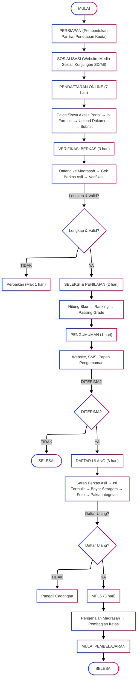

# PENERIMAAN PESERTA DIDIK BARU (PPDB) ONLINE

<!-- FIXME: Pemadanan data -->

|                       |                                                                                                          |
| --------------------- | -------------------------------------------------------------------------------------------------------- |
| **Kode SOP**          | SOP/AKD/001                                                                                              |
| **Tanggal Pembuatan** | 2 Januari 2025                                                                                           |
| **Tanggal Revisi**    | -                                                                                                        |
| **Tanggal Efektif**   | 2 Januari 2025                                                                                           |
| **Disahkan oleh**     | Kepala MTs Negeri 1 Pandeglang                                                                           |
| **Nama Prosedur**     | Penerimaan Peserta Didik Baru (PPDB) Online                                                              |
| **Dasar Hukum**       | 1. Permendikbud No. 1 Tahun 2021 2. Juknis PPDB Kemenag 3. SK Kepala Madrasah tentang Panitia PPDB |

---

## 1. TUJUAN

- Memberikan akses yang adil dan transparan dalam penerimaan peserta didik baru
- Mempermudah calon siswa mendaftar secara online
- Meminimalisir praktik kecurangan dan pungutan liar
- Meningkatkan efisiensi dan akuntabilitas proses PPDB

## 2. RUANG LINGKUP

SOP ini berlaku untuk:

- Pendaftaran calon peserta didik baru kelas VII
- Sistem PPDB Online Kementerian Agama
- Jalur prestasi, afirmasi, perpindahan tugas orang tua, dan zonasi
- Seluruh tahapan dari pendaftaran hingga daftar ulang

## 3. DEFINISI

- **PPDB**: Penerimaan Peserta Didik Baru
- **Zonasi**: Sistem penerimaan berdasarkan jarak tempat tinggal ke madrasah
- **Prestasi**: Jalur penerimaan berdasarkan nilai rapor atau prestasi lain
- **Afirmasi**: Jalur penerimaan untuk siswa dari keluarga tidak mampu
- **Daftar Ulang**: Proses registrasi calon siswa yang diterima

## 4. PENANGGUNG JAWAB

- **Kepala Madrasah**: Penanggung jawab PPDB
- **Ketua Panitia PPDB**: Koordinator pelaksanaan PPDB
- **Sekretaris PPDB**: Administrasi dan dokumentasi
- **Sie. Verifikasi**: Pemeriksaan berkas dan validasi data
- **Sie. IT**: Pengelolaan sistem online
- **Sie. Humas**: Sosialisasi dan informasi

---

## 5. JALUR PENERIMAAN

### A. JALUR REGULER (70% dari daya tampung)

**Persyaratan:**

1. Akta kelahiran atau surat keterangan lahir
2. Kartu Keluarga (KK)
3. Ijazah SD/MI atau Surat Keterangan Lulus
4. Surat Keterangan Domisili (jika KK tidak sesuai)
5. Pas foto 3x4 (3 lembar)

**Kriteria:**

- Nilai Tes: 100%

---

### B. JALUR PRESTASI (15% dari daya tampung)

**Persyaratan Umum:**

1. Akta kelahiran
2. Kartu Keluarga
3. Ijazah SD/MI atau Surat Keterangan Lulus
4. Pas foto 3x4 (3 lembar)

**Persyaratan Khusus:**

- **Prestasi Akademik**: Rata-rata rapor minimal 85 (semester 10–12)
- **Prestasi Non-Akademik**: Piagam/sertifikat kejuaraan minimal tingkat kabupaten
  - Juara 1: tambah 10 poin
  - Juara 2: tambah 7 poin
  - Juara 3: tambah 5 poin
- **Hafalan Al-Qur'an**:
  - Hafal 3 juz: tambah 15 poin
  - Hafal 2 juz: tambah 10 poin
  - Hafal 1 juz: tambah 5 poin

**Kriteria Penilaian:**

- Nilai tes: 60%
- Prestasi kejuaraan: 25%
- Hafalan Al-Qur’an: 15%

---

### C. JALUR AFIRMASI (15% dari daya tampung)

**Persyaratan:**

1. Akta kelahiran
2. Kartu Keluarga
3. Ijazah SD/MI atau Surat Keterangan Lulus
4. Surat Keterangan Tidak Mampu (SKTM) dari Kelurahan/Desa
5. Kartu Program Penanganan Kemiskinan (PKH/KIP/KKS)
6. Pas foto 3x4 (3 lembar)

**Kriteria:**

- Penerima Program Indonesia Pintar (PIP)
- Pemegang Kartu Keluarga Sejahtera (KKS)
- Penerima Bantuan Sosial PKH
- Anak yatim/piatu/yatim piatu

---

## 6. TAHAPAN PPDB

### TAHAP 1: PERSIAPAN

| No  | Kegiatan                             | Pelaksana       | Waktu                | Keterangan          |
| --- | ------------------------------------ | --------------- | -------------------- | ------------------- |
| 1   | Pembentukan Panitia PPDB             | Kepala Madrasah | 3 bulan sebelum PPDB | SK Panitia          |
| 2   | Rapat koordinasi panitia             | Ketua Panitia   | 2 bulan sebelum      | Pembagian tugas     |
| 3   | Penetapan kuota dan jalur penerimaan | Panitia PPDB    | 2 bulan sebelum      | Sesuai daya tampung |
| 4   | Sosialisasi PPDB ke SD/MI            | Sie. Humas      | 2 bulan sebelum      | Kunjungan sekolah   |
| 5   | Pembuatan brosur dan spanduk         | Sie. Humas      | 1,5 bulan sebelum    | Media informasi     |
| 6   | Uji coba sistem PPDB Online          | Sie. IT         | 1 bulan sebelum      | Testing sistem      |

---

### TAHAP 2: SOSIALISASI (2 minggu)

| No  | Kegiatan                                     | Pelaksana    | Waktu        | Keterangan            |
| --- | -------------------------------------------- | ------------ | ------------ | --------------------- |
| 1   | Pengumuman jadwal PPDB di website dan medsos | Sie. Humas   | H-14         | Online                |
| 2   | Pemasangan spanduk dan baliho                | Sie. Humas   | H-14         | Lokasi strategis      |
| 3   | Kunjungan ke SD/MI se-Kecamatan              | Panitia PPDB | H-14 s.d H-7 | Sosialisasi langsung  |
| 4   | Open house madrasah                          | Panitia PPDB | H-7          | Kunjungan calon siswa |
| 5   | Publikasi media massa lokal                  | Sie. Humas   | H-10         | Koran/radio           |

---

### TAHAP 3: PENDAFTARAN ONLINE (7 hari)

| No  | Kegiatan                                 | Pelaksana | Waktu       | Keterangan             |
| --- | ---------------------------------------- | --------- | ----------- | ---------------------- |
| 1   | Calon siswa mengakses portal PPDB Online | Pendaftar | Setiap hari | ppdb.kemenag.go.id     |
| 2   | Mengisi formulir pendaftaran online      | Pendaftar | 30 menit    | Data pribadi lengkap   |
| 3   | Upload dokumen persyaratan (scan)        | Pendaftar | 20 menit    | Format PDF/JPG max 2MB |
| 4   | Memilih jalur pendaftaran                | Pendaftar | 5 menit     | Hanya 1 jalur          |
| 5   | Submit dan cetak bukti pendaftaran       | Pendaftar | 10 menit    | Nomor peserta otomatis |
| 6   | Monitoring pendaftar realtime            | Sie. IT   | Setiap hari | Dashboard admin        |

**Jadwal Pendaftaran:**

- Hari: Senin - Minggu
- Jam: 00.00 - 23.59 WIB (sistem online 24 jam)
- Helpdesk: 08.00 - 16.00 WIB

---

### TAHAP 4: VERIFIKASI BERKAS (3 hari)

| No  | Kegiatan                                          | Pelaksana         | Waktu          | Keterangan                         |
| --- | ------------------------------------------------- | ----------------- | -------------- | ---------------------------------- |
| 1   | Pendaftar datang ke madrasah membawa berkas asli  | Pendaftar         | Sesuai jadwal  | Maksimal H+2 setelah daftar online |
| 2   | Petugas menerima dan mengecek kelengkapan berkas  | Sie. Verifikasi   | 10 menit/orang | Checklist dokumen                  |
| 3   | Verifikasi keaslian dokumen                       | Sie. Verifikasi   | 15 menit/orang | Bandingkan asli-scan               |
| 4   | Pengukuran jarak rumah ke madrasah (jalur zonasi) | Sie. Verifikasi   | 10 menit       | Google Maps                        |
| 5   | Input status verifikasi ke sistem                 | Sie. IT           | 5 menit        | Approved/Rejected                  |
| 6   | Pemberian tanda bukti verifikasi                  | Sie. Verifikasi   | 5 menit        | Stempel & paraf                    |
| 7   | Pencatatan dalam buku ekspedisi                   | Sie. Administrasi | 5 menit        | Nomor urut                         |

**Berkas yang Ditolak:**

- Dokumen tidak lengkap
- Dokumen palsu/tidak sah
- Tidak sesuai jalur yang dipilih
- Pendaftar dapat melengkapi maksimal 1 hari sebelum penutupan verifikasi

---

### TAHAP 5: SELEKSI DAN PENILAIAN (2 hari)

| No  | Kegiatan                                       | Pelaksana       | Waktu  | Keterangan             |
| --- | ---------------------------------------------- | --------------- | ------ | ---------------------- |
| 1   | Rekapitulasi data pendaftar yang terverifikasi | Sie. IT         | 4 jam  | Export data            |
| 2   | Perhitungan skor tiap jalur                    | Panitia PPDB    | 1 hari | Sesuai bobot penilaian |
| 3   | Pemeringkatan pendaftar per jalur              | Panitia PPDB    | 4 jam  | Urut nilai tertinggi   |
| 4   | Penentuan passing grade                        | Ketua Panitia   | 2 jam  | Sesuai daya tampung    |
| 5   | Pembuatan daftar calon siswa diterima          | Panitia PPDB    | 4 jam  | Per jalur              |
| 6   | Verifikasi akhir oleh Kepala Madrasah          | Kepala Madrasah | 2 jam  | Pengesahan             |

---

### TAHAP 6: PENGUMUMAN (1 hari)

| No  | Kegiatan                                   | Pelaksana    | Waktu    | Keterangan                 |
| --- | ------------------------------------------ | ------------ | -------- | -------------------------- |
| 1   | Upload hasil seleksi ke sistem PPDB Online | Sie. IT      | 1 jam    | pukul 00.00 WIB            |
| 2   | Publikasi di website madrasah              | Sie. Humas   | 1 jam    | www.mtsn1pandeglang.sch.id |
| 3   | Pemasangan pengumuman di papan pengumuman  | Sie. Humas   | 30 menit | Madrasah                   |
| 4   | Broadcast ke nomor HP pendaftar            | Sie. IT      | 2 jam    | WhatsApp/SMS               |
| 5   | Publikasi media sosial                     | Sie. Humas   | 30 menit | IG, FB, Twitter            |
| 6   | Buka posko informasi dan konsultasi        | Panitia PPDB | Seharian | 08.00-16.00 WIB            |

**Informasi yang Diumumkan:**

- Nomor pendaftaran
- Nama lengkap
- Asal sekolah
- Jalur pendaftaran
- Status (DITERIMA/TIDAK DITERIMA)
- Jadwal daftar ulang

---

### TAHAP 7: DAFTAR ULANG (3 hari)

| No  | Kegiatan                                    | Pelaksana         | Waktu         | Keterangan          |
| --- | ------------------------------------------- | ----------------- | ------------- | ------------------- |
| 1   | Siswa diterima datang dengan orang tua/wali | Siswa             | Sesuai jadwal | Bawa berkas asli    |
| 2   | Pengisian formulir daftar ulang             | Siswa             | 15 menit      | Data lengkap        |
| 3   | Penyerahan berkas asli:                     |                   |               |                     |
|     | - Ijazah asli SD/MI                         | Siswa             | 5 menit       | Disimpan madrasah   |
|     | - SKHUN asli                                | Siswa             | 5 menit       | Disimpan madrasah   |
|     | - Akta kelahiran (fotokopi)                 | Siswa             | 5 menit       | -                   |
|     | - KK (fotokopi)                             | Siswa             | 5 menit       | -                   |
|     | - KTP ortu (fotokopi)                       | Siswa             | 5 menit       | -                   |
|     | - Pas foto 3x4 (5 lembar)                   | Siswa             | 5 menit       | Background merah    |
| 4   | Pengecekan kesehatan awal                   | Sie. Kesiswaan    | 10 menit      | Tinggi, berat badan |
| 5   | Pembayaran biaya seragam (jika ada)         | Siswa             | 10 menit      | Bendahara           |
| 6   | Pengisian data di buku induk sementara      | Sie. Administrasi | 15 menit      | Data pokok          |
| 7   | Pemberian nomor induk siswa sementara       | Sie. Administrasi | 5 menit       | NIS sementara       |
| 8   | Foto siswa untuk database                   | Sie. IT           | 5 menit       | Untuk kartu pelajar |
| 9   | Penandatanganan pakta integritas            | Ortu & Siswa      | 10 menit      | Komitmen            |
| 10  | Penyerahan buku panduan siswa baru          | Sie. Kesiswaan    | 5 menit       | Panduan PSB         |
| 11  | Pemberian tanda bukti daftar ulang          | Sie. Administrasi | 5 menit       | Untuk MPLS          |

**Waktu Daftar Ulang:**

- Senin-Rabu: 08.00-14.00 WIB
- Jika tidak daftar ulang sesuai jadwal, dianggap mengundurkan diri

---

### TAHAP 8: PENGISIAN KUOTA KOSONG (2 hari)

**Jika ada siswa yang tidak daftar ulang:**

| No  | Kegiatan                                   | Pelaksana    | Waktu  | Keterangan       |
| --- | ------------------------------------------ | ------------ | ------ | ---------------- |
| 1   | Rekapitulasi siswa yang tidak daftar ulang | Panitia PPDB | 2 jam  | Per jalur        |
| 2   | Pengumuman cadangan yang dipanggil         | Sie. Humas   | 1 jam  | Via HP & website |
| 3   | Siswa cadangan melakukan daftar ulang      | Siswa        | 2 hari | Prosedur sama    |

---

### TAHAP 9: MASA PENGENALAN LINGKUNGAN SEKOLAH (3 hari)

| No  | Kegiatan                        | Pelaksana       | Waktu  | Keterangan                |
| --- | ------------------------------- | --------------- | ------ | ------------------------- |
| 1   | Pelaksanaan MPLS                | Panitia MPLS    | 3 hari | Sesuai juknis Kemendikbud |
| 2   | Pengenalan visi-misi madrasah   | Kepala Madrasah | 2 jam  | Hari-1                    |
| 3   | Pengenalan tata tertib madrasah | Waka Kesiswaan  | 2 jam  | Hari-1                    |
| 4   | Pengenalan kurikulum            | Waka Kurikulum  | 2 jam  | Hari-2                    |
| 5   | Pengenalan ekstrakurikuler      | Pembina Ekskul  | 2 jam  | Hari-2                    |
| 6   | Motivasi belajar                | Guru BK         | 2 jam  | Hari-3                    |
| 7   | Pembagian kelas                 | Waka Kurikulum  | 1 jam  | Hari-3                    |

---

## 7. KUOTA DAN DAYA TAMPUNG

**Tahun Pelajaran 2025/2026:**

- Total Daya Tampung: 320 siswa (10 rombel @ 32 siswa)

**Pembagian per Jalur:**
| Jalur | Kuota | Persentase |
|-----------|-------------|------------|
| Reguler | 224 siswa | 70% |
| Prestasi | 48 siswa | 15% |
| Afirmasi | 48 siswa | 15% |
| **TOTAL** | **320 siswa** | **100%** |

---

## 8. DIAGRAM ALUR PPDB

---

## 9. JAM PELAYANAN

**Pendaftaran Online:**

- Sistem: 24 jam non-stop
- Helpdesk: Senin-Minggu, 08.00-16.00 WIB

**Verifikasi Berkas:**

- Senin-Kamis: 08.00-14.30 WIB
- Jumat: 08.00-10.30 WIB
- Sabtu: 08.00-12.00 WIB

**Daftar Ulang:**

- Senin-Rabu: 08.00-14.00 WIB

---

## 10. BIAYA

**Prinsip: PPDB GRATIS (Tidak ada pungutan)**

**Biaya yang Boleh Dipungut:**

- Seragam sekolah (opsional, dapat dicicil)
- Buku paket (jika tidak dari dana BOS)
- Biaya lain-lain sesuai kesepakatan komite

**DILARANG:**

- Pungutan untuk pendaftaran
- Pungutan untuk seleksi
- Pungutan untuk daftar ulang
- Percaloan atau jasa perantara

---

## 11. LOKASI DAN KONTAK

**Sekretariat Panitia PPDB:**
MTs Negeri 1 Pandeglang
Jl. [Alamat Lengkap]
Telp: [Nomor Telepon]
WhatsApp: [Nomor WA]
Email: ppdb@mtsn1pandeglang.sch.id
Website: www.mtsn1pandeglang.sch.id

**Hotline PPDB:**

- Ketua Panitia: [Nomor HP]
- Sekretaris: [Nomor HP]
- Sie. Verifikasi: [Nomor HP]
- Sie. IT: [Nomor HP]

---

## 12. PENCATATAN DAN PELAPORAN

### A. Dokumen yang Dibuat:

1. **Buku Pendaftar:**
   | No | No. Pendaftaran | Nama | Asal Sekolah | Jalur | Tanggal Daftar |
   |----|-----------------|------|--------------|-------|----------------|

2. **Buku Verifikasi:**
   | No | No. Pendaftaran | Nama | Status Verifikasi | Keterangan | Petugas |
   |----|-----------------|------|-------------------|------------|---------|

3. **Buku Daftar Ulang:**
   | No | NIS | Nama | Ortu | Alamat | Tanggal Daftar Ulang | TTD |
   |----|-----|------|------|--------|----------------------|-----|

### B. Laporan:

1. Laporan harian pendaftaran (kepada Kepala Madrasah)
2. Laporan verifikasi (setiap akhir hari)
3. Laporan hasil seleksi (sebelum pengumuman)
4. Laporan daftar ulang (setiap hari)
5. Laporan akhir PPDB (kepada Kantor Kemenag Kabupaten)

---

## 13. HAK DAN KEWAJIBAN

### Hak Pendaftar:

- Mendapat informasi PPDB yang jelas
- Mendaftar tanpa diskriminasi
- Mendapat pelayanan yang adil
- Mengajukan keberatan jika ditolak
- Mendapat bukti pendaftaran

### Kewajiban Pendaftar:

- Mengisi data dengan benar dan jujur
- Menyerahkan dokumen asli dan sah
- Mengikuti prosedur yang ditentukan
- Daftar ulang sesuai jadwal

### Hak Madrasah:

- Menolak pendaftar yang tidak memenuhi syarat
- Membatalkan penerimaan jika ditemukan pemalsuan dokumen
- Menetapkan jalur dan kuota penerimaan

### Kewajiban Madrasah:

- Memberikan informasi yang transparan
- Melayani pendaftar dengan ramah
- Tidak memungut biaya pendaftaran
- Mengumumkan hasil seleksi tepat waktu

---

## 14. PENGADUAN

**Jenis Pengaduan:**

- Ketidakpuasan layanan
- Dugaan kecurangan
- Kesalahan data
- Pungutan liar

**Cara Pengaduan:**

- Datang langsung ke sekretariat PPDB
- Email: pengaduan@mtsn1pandeglang.sch.id
- WhatsApp: [Nomor WA]
- Kotak saran

**Tindak Lanjut:**

- Maksimal 2x24 jam

---

## 15. PENUTUP

SOP ini berlaku sejak tanggal ditetapkan dan akan dievaluasi setiap tahun untuk penyempurnaan.

---

Ditetapkan di: Pandeglang  
Pada Tanggal: 2 Januari 2025

**Kepala MTs Negeri 1 Pandeglang**

**H. EMAN SULAIMAN, S.Ag., M.Pd.**  
NIP. 197006032000031002
