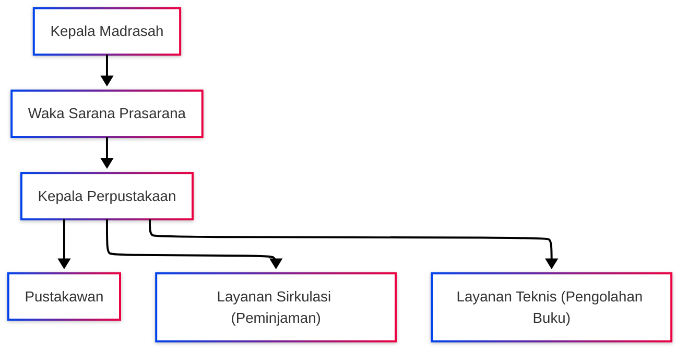

# PENGELOLAAN PERPUSTAKAAN

<!-- FIXME: Pemadanan data -->

|                       |                                                                                                            |
| --------------------- | ---------------------------------------------------------------------------------------------------------- |
| **Kode SOP**          | SOP/AKD/008                                                                                                |
| **Tanggal Pembuatan** | 2 Januari 2025                                                                                             |
| **Tanggal Revisi**    | -                                                                                                          |
| **Tanggal Efektif**   | 2 Januari 2025                                                                                             |
| **Disahkan oleh**     | Kepala MTs Negeri 1 Pandeglang                                                                             |
| **Nama Prosedur**     | Pengelolaan Perpustakaan                                                                                   |
| **Dasar Hukum**       | 1. UU No. 43 Tahun 2007 tentang Perpustakaan<br>2. Permendikbud No. 23 Tahun 2015<br>3. SK Kepala Madrasah |

---

## 1. TUJUAN

- Mengelola perpustakaan secara profesional dan efektif
- Menyediakan sumber belajar yang berkualitas bagi siswa dan guru
- Meningkatkan minat baca dan literasi warga madrasah
- Menjaga dan merawat koleksi perpustakaan dengan baik

## 2. RUANG LINGKUP

SOP ini mengatur:

- Pengelolaan koleksi buku dan bahan pustaka
- Layanan perpustakaan kepada pengguna
- Sistem katalogisasi dan klasifikasi
- Perawatan dan pemeliharaan koleksi
- Pengadaan buku baru
- Penghapusan buku rusak/hilang

## 3. DEFINISI

- **Pustakawan**: Petugas yang mengelola perpustakaan
- **Koleksi**: Semua bahan pustaka yang dimiliki perpustakaan
- **Katalog**: Daftar sistematis koleksi perpustakaan
- **Klasifikasi**: Pengelompokan buku berdasarkan subjek
- **Anggota**: Siswa, guru, dan tenaga kependidikan yang terdaftar

## 4. PENANGGUNG JAWAB

- **Kepala Madrasah**: Penanggung jawab keseluruhan
- **Wakil Kepala Sarana Prasarana**: Pembina perpustakaan
- **Kepala Perpustakaan**: Pengelola perpustakaan
- **Pustakawan**: Pelaksana teknis
- **Tenaga Layanan**: Pembantu pustakawan

---

## 5. STRUKTUR ORGANISASI PERPUSTAKAAN



---

## 6. TUGAS DAN TANGGUNG JAWAB

### A. Kepala Perpustakaan:

1. Menyusun program kerja perpustakaan (tahunan dan semester)
2. Mengelola dan mengembangkan koleksi
3. Mengkoordinir layanan perpustakaan
4. Membuat laporan berkala
5. Mengajukan anggaran perpustakaan
6. Melakukan evaluasi dan pengembangan

### B. Pustakawan:

1. Melayani peminjaman dan pengembalian buku
2. Membantu siswa mencari referensi
3. Mengolah buku baru (katalogisasi, klasifikasi, labeling)
4. Merawat dan memperbaiki buku rusak
5. Mendata buku hilang/rusak
6. Menjaga kebersihan dan kerapihan perpustakaan

### C. Tenaga Layanan:

1. Membantu layanan sirkulasi (peminjaman/pengembalian)
2. Menjaga ketertiban di ruang baca
3. Membantu inventarisasi
4. Merapikan rak buku

---

## 7. JAM BUKA PERPUSTAKAAN

**Hari Kerja:**

- Senin - Kamis: 07.30 - 15.00 WIB
- Jumat: 07.30 - 11.00 WIB
- Sabtu: 07.30 - 13.00 WIB

**Istirahat:**

- 10.00 - 10.15 WIB
- 12.00 - 13.00 WIB (Senin-Kamis)

**Libur:** Hari Minggu dan Tanggal Merah

**Jam Khusus:**

- Istirahat (09.30-10.00): Khusus siswa yang ingin baca santai
- Sebelum/sesudah sekolah: Belajar mandiri/kelompok

---

## 8. TATA TERTIB PERPUSTAKAAN

### A. Untuk Pengunjung:

**WAJIB:**

1. Menunjukkan kartu anggota perpustakaan
2. Menitipkan tas di loker yang disediakan
3. Menjaga ketenangan (tidak gaduh)
4. Menjaga kebersihan (tidak makan/minum di ruang baca)
5. Mengembalikan buku ke rak dengan benar
6. Melapor ke petugas jika menemukan buku rusak
7. Mengisi buku tamu

**DILARANG:**

1. Membawa makanan dan minuman ke ruang baca
2. Merusak, mencoret, atau merobek buku
3. Membawa buku keluar tanpa izin petugas
4. Menggunakan HP dengan suara keras
5. Tidur di perpustakaan
6. Merokok
7. Membuat keributan

### B. Sanksi Pelanggaran:

| Pelanggaran                        | Sanksi                                            |
| ---------------------------------- | ------------------------------------------------- |
| Terlambat mengembalikan (1-7 hari) | Peringatan lisan                                  |
| Terlambat mengembalikan (>7 hari)  | Tidak boleh pinjam selama 1 bulan                 |
| Hilangkan buku                     | Ganti buku yang sama/sejenisnya/uang sesuai harga |
| Merusak buku (ringan)              | Perbaiki + denda Rp 5.000                         |
| Merusak buku (berat)               | Ganti buku yang sama + denda Rp 10.000            |
| Membawa keluar tanpa izin          | Skorsing 1 semester                               |
| Merusak fasilitas perpustakaan     | Ganti rugi + skorsing                             |

---

## 9. KEANGGOTAAN PERPUSTAKAAN

### A. Syarat Menjadi Anggota:

**Untuk Siswa:**

1. Siswa aktif MTs Negeri 1 Pandeglang
2. Mengisi formulir pendaftaran
3. Foto 2x3 (1 lembar)
4. Fotokopi kartu pelajar

**Untuk Guru/Karyawan:**

1. Guru/karyawan aktif di MTs Negeri 1 Pandeglang
2. Mengisi formulir pendaftaran
3. Foto 2x3 (1 lembar)

### B. Prosedur Pendaftaran:

| No  | Kegiatan                                       | Pelaksana     | Waktu    | Keterangan            |
| --- | ---------------------------------------------- | ------------- | -------- | --------------------- |
| 1   | Mengambil formulir pendaftaran                 | Calon Anggota | 5 menit  | Di loket perpustakaan |
| 2   | Mengisi formulir dengan lengkap                | Calon Anggota | 10 menit | -                     |
| 3   | Menyerahkan formulir + foto + fc kartu pelajar | Calon Anggota | 5 menit  | Ke petugas            |
| 4   | Petugas verifikasi data                        | Pustakawan    | 10 menit | Cek di database siswa |
| 5   | Input data anggota ke sistem                   | Pustakawan    | 10 menit | Beri nomor anggota    |
| 6   | Cetak kartu anggota perpustakaan               | Pustakawan    | 1 hari   | -                     |
| 7   | Penyerahan kartu anggota                       | Pustakawan    | 5 menit  | TTD bukti terima      |

**Waktu Penyelesaian:** 1-2 hari kerja  
**Biaya:** GRATIS

**Masa Berlaku Kartu:**

- Siswa: Selama masih aktif bersekolah
- Guru/Karyawan: Selama masih aktif bekerja

---

## 10. PENGADAAN BUKU BARU

### A. Sumber Pengadaan:

1. **Dana BOS**: Alokasi khusus perpustakaan
2. **Bantuan Pemerintah**: Kemenag, Kemendikbud
3. **Hibah**: Dari donatur/instansi
4. **Hasil usaha**: Kegiatan penggalangan dana

### B. Prosedur Pengadaan:

| No  | Kegiatan                               | Pelaksana           | Waktu      | Keterangan                |
| --- | -------------------------------------- | ------------------- | ---------- | ------------------------- |
| 1   | Survei kebutuhan buku                  | Kepala Perpustakaan | 1 minggu   | Dari usulan guru & siswa  |
| 2   | Penyusunan daftar usulan buku          | Kepala Perpustakaan | 3 hari     | Prioritas kebutuhan       |
| 3   | Verifikasi oleh Waka Kurikulum         | Waka Kurikulum      | 3 hari     | Sesuai kurikulum          |
| 4   | Pengajuan ke Bendahara/Kepala Madrasah | Kepala Perpustakaan | 1 hari     | Proposal pengadaan        |
| 5   | Persetujuan anggaran                   | Kepala Madrasah     | 1 minggu   | Sesuai ketersediaan dana  |
| 6   | Survey harga ke toko buku              | Tim Pengadaan       | 1 minggu   | Min. 3 toko               |
| 7   | Pembelian buku                         | Tim Pengadaan       | 1-2 minggu | Sesuai prosedur pengadaan |
| 8   | Penerimaan dan verifikasi buku         | Kepala Perpustakaan | 1 hari     | Cek kualitas & jumlah     |
| 9   | Berita Acara Serah Terima              | Tim Pengadaan       | 1 hari     | Dokumentasi               |

**Total Waktu:** 1-2 bulan (tergantung prosedur pengadaan)

---

## 11. PENGOLAHAN BUKU BARU

### A. Tahapan Pengolahan:

| No  | Kegiatan                                  | Pelaksana  | Waktu         | Keterangan                                    |
| --- | ----------------------------------------- | ---------- | ------------- | --------------------------------------------- |
| 1   | **Inventarisasi**                         |            |               |                                               |
|     | - Mencatat buku di buku induk             | Pustakawan | 10 menit/buku | Nomor urut, judul, pengarang, penerbit, tahun |
|     | - Memberi nomor inventaris                | Pustakawan | 5 menit/buku  | Stempel di halaman tertentu                   |
|     | - Input ke database/sistem                | Pustakawan | 10 menit/buku | SLiMS/aplikasi lain                           |
| 2   | **Klasifikasi**                           |            |               |                                               |
|     | - Menentukan subjek buku                  | Pustakawan | 10 menit/buku | Sesuai DDC (Dewey Decimal Classification)     |
|     | - Memberi nomor klasifikasi               | Pustakawan | 5 menit/buku  | Contoh: 297 (Agama Islam)                     |
| 3   | **Katalogisasi**                          |            |               |                                               |
|     | - Membuat kartu katalog                   | Pustakawan | 15 menit/buku | Judul, pengarang, subjek                      |
|     | - Input katalog ke sistem                 | Pustakawan | 10 menit/buku | OPAC (Online Public Access Catalog)           |
| 4   | **Labeling**                              |            |               |                                               |
|     | - Membuat call number (label punggung)    | Pustakawan | 5 menit/buku  | Nomor klasifikasi + kode                      |
|     | - Tempel label di punggung buku           | Pustakawan | 5 menit/buku  | Rapi dan mudah dibaca                         |
|     | - Tempel barcode (jika ada sistem)        | Pustakawan | 3 menit/buku  | Untuk pemindaian                              |
| 5   | **Shelving (Penyusunan di Rak)**          |            |               |                                               |
|     | - Menyusun buku di rak sesuai klasifikasi | Pustakawan | 5 menit/buku  | Urut nomor                                    |

**Total Waktu:** 1-1,5 jam per buku

---

## 12. SISTEM KLASIFIKASI BUKU

**Menggunakan DDC (Dewey Decimal Classification):**

| Nomor | Subjek                                         |
| ----- | ---------------------------------------------- |
| 000   | Karya Umum (Ensiklopedi, Kamus, Komputer)      |
| 100   | Filsafat & Psikologi                           |
| 200   | Agama                                          |
| 297   | Islam (Al-Qur'an, Hadits, Fiqh, Akhlak)        |
| 300   | Ilmu Sosial (Ekonomi, Hukum, Pendidikan)       |
| 400   | Bahasa                                         |
| 500   | Ilmu Murni (Matematika, Fisika, Biologi)       |
| 600   | Ilmu Terapan (Teknologi, Pertanian, Kesehatan) |
| 700   | Kesenian & Olahraga                            |
| 800   | Kesusastraan                                   |
| 900   | Sejarah & Geografi                             |

**Contoh Call Number:**

```
297.12
FAR
p

Keterangan:
297.12 = Klasifikasi (Hadits)
FAR = 3 huruf pertama nama pengarang
p = Huruf pertama judul buku (pisah jika ada)
```

---

## 13. PERAWATAN KOLEKSI

### A. Perawatan Rutin:

| Kegiatan                               | Frekuensi        | Pelaksana      |
| -------------------------------------- | ---------------- | -------------- |
| Membersihkan debu buku dengan kemoceng | Setiap hari      | Tenaga Layanan |
| Merapikan buku di rak                  | Setiap hari      | Pustakawan     |
| Mengecek kondisi buku                  | Setiap minggu    | Pustakawan     |
| Memperbaiki buku rusak ringan          | Sesuai kebutuhan | Pustakawan     |
| Fumigasi (pengasapan anti rayap/jamur) | 6 bulan sekali   | Tim Khusus     |
| Stockopname (inventarisasi ulang)      | 1 tahun sekali   | Semua Tim      |

### B. Perbaikan Buku Rusak:

**Kerusakan Ringan:**

- Cover lepas: Lem ulang dengan lem khusus
- Halaman sobek: Tempel dengan lakban transparan
- Tulisan luntur: Fotokopi ulang halaman yang rusak

**Kerusakan Sedang:**

- Jilid rusak: Jilid ulang
- Banyak halaman sobek: Ganti cover + jilid ulang

**Kerusakan Berat:**

- Dimakan rayap/rusak parah: Diusulkan penghapusan
- Hilang sebagian besar halaman: Diusulkan penghapusan

---

## 14. PENGHAPUSAN BUKU

### A. Kriteria Penghapusan:

1. **Rusak berat** dan tidak dapat diperbaiki
2. **Usang/kadaluarsa** (informasi sudah tidak relevan)
3. **Hilang** dan sudah dicari maksimal
4. **Tidak pernah dipinjam** dalam 5 tahun terakhir (setelah evaluasi)
5. **Duplikat berlebihan**

### B. Prosedur Penghapusan:

| No  | Kegiatan                              | Pelaksana           | Waktu    | Keterangan            |
| --- | ------------------------------------- | ------------------- | -------- | --------------------- |
| 1   | Identifikasi buku yang akan dihapus   | Kepala Perpustakaan | 1 minggu | Survey kondisi        |
| 2   | Membuat daftar usulan penghapusan     | Kepala Perpustakaan | 3 hari   | Detail: judul, alasan |
| 3   | Verifikasi oleh Waka Sarana Prasarana | Waka Sarpras        | 3 hari   | -                     |
| 4   | Pengajuan ke Kepala Madrasah          | Kepala Perpustakaan | 1 hari   | Surat resmi           |
| 5   | Pembentukan Tim Penghapusan           | Kepala Madrasah     | 1 hari   | SK Tim                |
| 6   | Pemeriksaan fisik buku oleh Tim       | Tim Penghapusan     | 1 minggu | Cek kondisi           |
| 7   | Berita Acara Penghapusan              | Tim Penghapusan     | 1 hari   | Dokumentasi           |
| 8   | Pengesahan oleh Kepala Madrasah       | Kepala Madrasah     | 1 hari   | SK Penghapusan        |
| 9   | Penghapusan dari buku induk & sistem  | Pustakawan          | 1 hari   | Update database       |
| 10  | Pemusnahan buku (jika rusak berat)    | Tim Penghapusan     | 1 hari   | Didokumentasikan      |

**Total Waktu:** 3-4 minggu

---

## 15. LAYANAN PERPUSTAKAAN

### A. Jenis Layanan:

1. **Layanan Sirkulasi** (Peminjaman/Pengembalian) → Lihat SOP/AKD/009
2. **Layanan Referensi** (Membantu mencari informasi)
3. **Layanan Baca di Tempat**
4. **Layanan Fotokopi** (terbatas untuk keperluan belajar)
5. **Layanan Internet** (jika tersedia)
6. **Layanan Literasi** (program membaca, bedah buku, dll)

### B. Layanan Referensi:

**Cara Kerja:**

1. Siswa/guru bertanya kepada pustakawan
2. Pustakawan membantu mencari buku/informasi yang dibutuhkan
3. Mengajarkan cara menggunakan katalog
4. Memberikan rekomendasi buku

**Pertanyaan yang Sering Diajukan:**

- "Di mana buku tentang [topik]?"
- "Ada buku terbaru apa?"
- "Bagaimana cara mencari buku di katalog?"

---

## 16. PROGRAM PERPUSTAKAAN

### A. Program Rutin:

1. **Jam Wajib Kunjung Perpustakaan**

   - Setiap kelas: 1 jam per minggu
   - Dijadwalkan oleh Waka Kurikulum
   - Dipandu guru mapel/pustakawan

2. **Program Gemar Membaca**

   - Lomba membaca terbanyak per bulan
   - Hadiah untuk siswa terbaik
   - Papan prestasi peminjam teraktif

3. **Pojok Baca Kelas**

   - Setiap kelas memiliki pojok baca
   - Buku dari perpustakaan (sistem rolling)
   - Diganti setiap bulan

4. **Bedah Buku**
   - 1 bulan sekali
   - Mengundang penulis/guru
   - Diskusi buku tertentu

### B. Program Tahunan:

1. **Pekan Perpustakaan** (setiap September)

   - Lomba: resensi buku, desain bookmark, mading perpustakaan
   - Pameran buku
   - Donor buku

2. **Bulan Bahasa** (setiap Oktober)
   - Lomba puisi, cerpen
   - Penerbitan buletin karya siswa

---

## 17. PELAPORAN

### A. Laporan Bulanan (ke Kepala Madrasah):

1. Jumlah pengunjung perpustakaan
2. Jumlah peminjaman buku
3. Buku terpopuler
4. Anggota teraktif
5. Pengadaan buku baru (jika ada)
6. Buku rusak/hilang
7. Kendala dan solusi

### B. Laporan Semester:

1. Rekapitulasi 6 bulan
2. Evaluasi program perpustakaan
3. Rencana pengembangan
4. Usulan pengadaan buku semester depan

### C. Laporan Tahunan:

1. Laporan lengkap 1 tahun
2. Statistik lengkap
3. Evaluasi menyeluruh
4. Rencana kerja tahun depan
5. Disampaikan ke Kepala Madrasah dan Kemenag Kabupaten

---

## 18. ANGGARAN PERPUSTAKAAN

**Sumber Dana:**

1. Dana BOS (alokasi perpustakaan minimal 5%)
2. Bantuan Pemerintah
3. Hibah
4. Iuran sukarela (jika ada)

**Penggunaan:**

1. Pengadaan buku (60%)
2. Perawatan dan perbaikan (15%)
3. Pengembangan sistem (10%)
4. Program literasi (10%)
5. Lain-lain (5%)

---

## 19. EVALUASI PERPUSTAKAAN

### Indikator Keberhasilan:

| Indikator                     | Target               |
| ----------------------------- | -------------------- |
| Jumlah pengunjung per hari    | Min. 50 orang        |
| Rata-rata peminjaman per hari | Min. 30 buku         |
| Jumlah koleksi                | Min. 3.000 eksemplar |
| Buku per siswa                | Min. 5 judul         |
| Kepuasan pengguna             | Min. 85%             |

### Evaluasi Dilakukan:

- **Harian**: Jumlah pengunjung dan peminjaman
- **Bulanan**: Analisis statistik dan laporan
- **Semester**: Evaluasi program
- **Tahunan**: Evaluasi menyeluruh dan perencanaan

---

## 20. PENUTUP

Perpustakaan adalah jantung madrasah. Dengan pengelolaan yang baik, perpustakaan akan menjadi pusat belajar yang menyenangkan dan meningkatkan literasi warga madrasah.

---

Ditetapkan di: Pandeglang  
Pada Tanggal: 2 Januari 2025

**Kepala MTs Negeri 1 Pandeglang**

**H. EMAN SULAIMAN, S.Ag., M.Pd.**  
NIP. 197006032000031002
