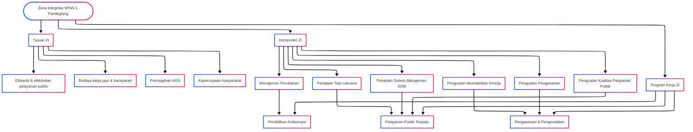

# ZONA INTEGRITAS

## Pengenalan

Zona Integritas (ZI) adalah komitmen MTs Negeri 1 Pandeglang untuk menciptakan lingkungan pendidikan yang bersih dari korupsi, kolusi, dan nepotisme, serta membangun budaya kerja yang jujur, transparan, dan profesional. Penerapan ZI bertujuan meningkatkan kepercayaan masyarakat terhadap madrasah sekaligus memastikan pelayanan publik yang berkualitas.

### Tujuan Zona Integritas

Zona Integritas di MTs Negeri 1 Pandeglang bertujuan untuk:

1. Meningkatkan efisiensi dan efektivitas pelayanan publik.
2. Membangun budaya kerja yang jujur, transparan, dan berintegritas.
3. Mencegah praktik korupsi, kolusi, dan nepotisme.
4. Meningkatkan kepercayaan masyarakat terhadap lembaga pendidikan.

---

## Diagram Zona Integritas

---

## Komponen Zona Integritas

### [Manajemen Perubahan](./manajemen-perubahan)

Mengubah pola pikir dan budaya kerja di lingkungan madrasah melalui sosialisasi, pelatihan, dan pembentukan agen perubahan. Fokus utamanya adalah membangun komitmen bersama dan kesiapan seluruh pegawai dalam mendukung transformasi menuju ZI.

### [Penataan Tata Laksana](./penataan-tata-laksana)

Menata sistem dan prosedur kerja agar lebih sederhana, efisien, dan terdigitalisasi. Meliputi penyusunan SOP, peta proses bisnis, sistem dokumentasi, serta penerapan e-office untuk meningkatkan kualitas administrasi.

### [Penataan Sistem Manajemen SDM](./penataan-sistem-manajemen-sdm)

Mengelola sumber daya manusia secara profesional melalui perencanaan kebutuhan pegawai, rekrutmen transparan, pengembangan kompetensi, penilaian kinerja objektif, serta sistem reward and punishment yang jelas.

### [Penguatan Akuntabilitas Kinerja](./penguatan-akuntabilitas-kinerja)

Meningkatkan akuntabilitas melalui perencanaan, pelaksanaan, dan evaluasi kinerja yang terukur. Meliputi penyusunan RKT, KPI, laporan kinerja, serta pelaksanaan monitoring dan evaluasi berkala.

### [Penguatan Pengawasan](./penguatan-pengawasan)

Memperkuat sistem pengawasan internal untuk mencegah penyimpangan. Dilakukan melalui audit internal, penerapan SPIP, mekanisme whistleblowing system, serta koordinasi dengan pengawas eksternal.

### [Penguatan Kualitas Pelayanan Publik](./penguatan-sistem-kualitas-pelayanan)

Meningkatkan mutu layanan kepada siswa, orang tua, dan masyarakat dengan standar pelayanan yang jelas, inovasi berbasis teknologi, survei kepuasan pelanggan, serta pelatihan service excellence bagi pegawai.

---

## Program Kerja Zona Integritas

### Pendidikan Antikorupsi

Program pendidikan antikorupsi bagi siswa dan pegawai untuk meningkatkan kesadaran tentang bahaya korupsi serta mendorong perilaku jujur dan berintegritas.

### Pelayanan Publik Terpadu

Pelayanan publik terpadu yang efisien dan terintegrasi, mencakup layanan administratif dan informasi yang mudah diakses oleh siswa, orang tua, dan masyarakat.

### Pengawasan dan Pengendalian

Pengawasan berkala oleh tim internal untuk memastikan seluruh kegiatan berjalan sesuai prinsip Zona Integritas, dengan evaluasi dan tindak lanjut terhadap setiap temuan.

---

## REFERENSI PERATURAN & PEDOMAN

### Regulasi Utama:

1. [KMA_186_2017](./dasar-hukum/KMA_186_2017.pdf)
2. [PermenPAN-RB No. 52 Tahun 2014](./dasar-hukum/PermenPAN-RB-No.-52-Tahun-2014.pdf)
3. [PermenPAN-RB No. 10 Tahun 2019](./dasar-hukum/PermenPAN-RB-No.-10-Tahun-2019.pdf)
4. [PermenPAN-RB No. 90 Tahun 2021](./dasar-hukum/PermenPAN-RB-No.-90-Tahun-2021.pdf)
5. [PermenPAN-RB No. 5 Tahun 2024](./dasar-hukum/PermenPAN-RB-No.-5-Tahun-2024.pdf)
